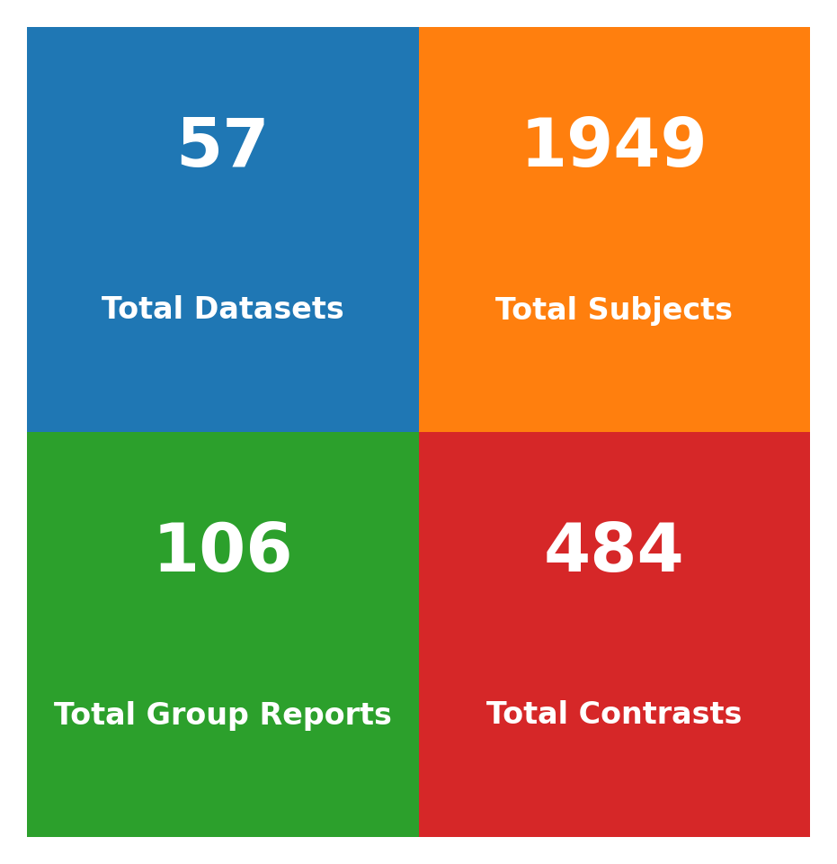

# OpenNeuro GLM Fitlins
[](https://doi.org/10.5281/zenodo.15376890)

**Curator & Maintainer**: Michael Demidenko  

> *This repository would not be possible if researchers did not make their task fMRI data publicly available, and the awesome people who have worked on and continue to work on OpenNeuro, BIDS Stats Models and Fitlins.*

**Contact**: [demidenko.michael@gmail.com](mailto:demidenko.michael@gmail.com)

*This repository is in active development. `Last updated: 2025-09-03`*




N OpenNeuro Studies: 57

N OpenNeuro Task fMRI Group Summaries: 105

Completed fMRI Task Names: 1dNF, 1Norm, 2dNF, 2Swallow, 3HandA, 4HandB, 5Eyes, 6DeepBreathing, abstractconcretejudgment, antisaccadetaskwithfixedorder, arithm, auditoryfeedback, balloonanalogrisktask, balloonanalogrisktask, ChangeDetection, cmp, ColorDots, compL1, compLn, conditionalstopsignal, covertverbgeneration, deterministicclassification, dis, discounting, doors, dts, ec, em, emotionalfaces, emotionalregulation, Emotionregulation, encoding, epr, eye, faceexplocalizer, faceidentityoddball, facerecognition, familiarity, fb, feedback, figure2backwith1backlures, fingerfootlips, flanker, flavor, FoodChoice, FoodStimHiLo, gas, gas, GDMotor, identify1, identify2, illusion, learning, letter0backtask, letter1backtask, letter2backtask, linebisection, Memory, MGT, mid, mid, MIDmb4, MIDmb8, MIDsingle, mixedeventrelatedprobe, mixedgamblestask, modulate1, music, nofeedback, nonmusic, objectviewing, overtverbgeneration, overtwordrepetition, ParallelAdaptation, passiveimageviewing, pc, PenaltyKik, prelearning, probabilisticclassification, prodL1, prodLn, regulate, retrieval, reversalweatherprediction, roletrait, sae, sar, socialcomparison, socialdoors, stopsignal, stopsignal, task, theoryofmindwithmanualresponse, TrainedHandTrainedSequence, TrainedHandUntrainedSequence, training, UntrainedHandTrainedSequence, UntrainedHandUntrainedSequence, verbs, viewFigure, viewing, viewRandom, visualfeedback, weatherprediction, wm

## Overview

`openneuro_glmfitlins` provides a streamlined workflow for analyzing neuroimaging datasets using [FitLins](https://github.com/poldracklab/fitlins)</a> via [BIDS Stats Models](https://bids-standard.github.io/stats-models/). The repository supports both **OpenNeuro datasets** and **local "house" datasets**, generating comprehensive reports for datasets and tasks processed through GLM Fitlins, with two primary goals:

1. Facilitate efficient and reproducible neuroimaging data analysis
2. Provide minimal barriers to entry for researchers at all levels

The FitLins workflow estimates statistical maps (e.g., z-stat, t-stat) across several levels, including `runLevel` (subject-level run contrast maps), `subjectLevel` (fixed-effect averages across runs), and `dataLevel` (group-level average maps). Group results summarize the models and activation maps for each study and task. The provided specification files are sufficient to download and reproduce all outputs for OpenNeuro datasets, or to analyze your local datasets. If you are unable to run the workflow but are interested in outputs for any of the datasets listed in `statsmodel_specs`, please feel free to reach out.


*Note: If you're simply interested in looking at the task-specific group reports, all of that information is in the subfolders `statsmodel_specs/<studyID>/group_<taskname>`. *
> The modeling decisions reported here are only recommendations. Each analysis should embark on its own quality control, behavioral data evaluation and final sample selection.

# Community Contributions

Contributions can be made in several ways:

1.  **Review Design Matrices and Model Specifications:**
    * Examine the design matrices and model specifications for various studies located in the [`./statsmodel_specs/`](./statsmodel_specs/) directory.
    * Recommend fixes related to:
        * **Model Specifications:** This includes the resulting design matrices. Models can be adjusted by including or excluding regressors and modifying the convolution used.
        * **Contrast Lists:** Suggest removing or adding specific contrasts to better capture a `specific` cognitive process reflected in the estimated BOLD response.

2.  **Review Event File Modifications:**
    * Examine the [`./scripts/prep_report_py/modify_events.py`](./scripts/prep_report_py/modify_events.py) script.
    * Make recommendations for alternative ways to modify the events files, focusing on:
        * Improving the efficiency of the modifications.
        * Creating additional regressors that may have been overlooked.

3.  **Run Datasets and Contribute Results:**
    * Run datasets on your own machine.
    * Create model specifications and generate group-level reports.
    * Submit pull requests to add your results as contributions to the `statsmodel_specs` folder.

**Using the Issues Tab:**

For items related to specific issues, please use the `Issues` tab. There are separate templates available for:
* `Events Modification`: Revisions to current modifications to events files
* `Contrasts`: Recommendations to make changes to current contrasts lists.
* `Model Specification`: Recommendations to make changes to current model specifications.
* `Running Fitlins Models`: Requests to run OpenNeuro Datasets that have Task BOLD, Events files & fMRIPrep'd derivatives 


## Features

- **Automatic Environment Setup**: Uses [setup_uv.sh](setup_uv.sh) to install [uv](https://docs.astral.sh/uv/guides/install-python/) Python package manager, verify dependencies (GitHub, DataLad, git-annex), and create an environment with required packages (for more details on uv and packaging notes, see [Dr. Mumford's repo](https://github.com/jmumford/packaging-notes?tab=readme-ov-file#uv)
- **Automated Data Retrieval**: Leverages DataLad and AWS CLI to clone BIDS input data and download fMRIPrep preprocessed MRI/fMRI data, automatically determining preprocessing completeness
- **Flexible Analysis Configuration**: Generates summaries of relevant subject, run, and task fMRI data to facilitate statistical model creation
- **Reproducible Environments**: Ensures computational reproducibility through `uv` environment and exported specification files
- **HPC Integration**: Simplifies recomputation of minimally preprocessed MRI data and FitLins modeling on high-performance computing clusters
- **Comprehensive Reporting**: Generates detailed summary reports at both individual and group levels, including event details, model specifications, contrasts, regressors, variance inflation factors and group-statistical z-scored statistical maps

## Repository Structure

- `scripts/`: Core scripts for the complete workflow
   - `./scripts/cluster_jobs/`: Templates for fMRIPrep, fitlins, and [pilot] nilearn jobs on HPC clusters
   - `./scripts/prep_report_py/`: Python scripts and JSON files for the workflow steps. Users typically only need to modify:
     - `modify_events.py`: For preprocessing events files
     - `file_exclusions.json`: To limit OpenNeuro Dataset & fMRIPrep derivatives download size

- `statsmodel_specs/`: JSON files defining statistical models for each OpenNeuro study, including MRIQC summaries and README files
- `LICENSE`: MIT License
- `path_config.json`: Configuration file for directory paths

## Prerequisites

- **System Dependencies**:
  - [AWS CLI](https://docs.aws.amazon.com/cli/latest/userguide/install-cliv2.html))
  - [DataLad](https://www.datalad.org/)
  - Git (≥ 2.2)

### **Python Dependencies**

- **Python version**: 3.12+  

- **Major packages**:
  - `numpy` (≥ 1.26.0)
  - `pandas` (≥ 2.0.0)
  - `datalad` (≥ 0.16.0)
  - `nilearn` (≥ 0.9.2) - pre-dates issue for returned maps in computed_fixed estimates for `precision_weighted=True`
  - `matplotlib` (>=3.7.0)
  - `seaborn` (>=0.12.0)
  - Jupyter ecosystem:
    - `nbformat` (≥ 5.8.0)
    - `IPython` (≥ 8.0.0)
    - `jupyter` (≥ 1.0.0)
    - `notebook` (≥ 7.0.0)
  - `awscli`
  - `scipy`
  - `argparse`
  - `pyrelimri`
  - `templateflow`
    - awscli, scipy, argparse
  - Custom installations to resolve compatibility issues:
    - fitlins: `git+https://github.com/jmumford/fitlins.git@paddedint`
    - pybids: `git+https://github.com/bids-standard/pybids.git`

## Installation & Usage


1. **Clone the repository**:
   ```bash
   git clone https://github.com/demidenm/openneuro_glmfitlins.git
   ```

2. **Set up environment**:
   ```bash
   cd openneuro_glmfitlins
   bash setup_uv.sh
   ```

3. **Configure paths** in `path_config.json`:
   - `datasets_folder`: Location for BIDS, fMRIPrep, and analyses data
   - `openneuro_glmrepo`: Path to the cloned repository
   - `tmp_folder`: Temporary/scratch space for FitLins processing
   - `fmriprep_simg`: Singularity image for fMRIPrep
   - `freesurfer_license`: Path to Freesurfer license file
   - `data_type`: Whether 'openneuro' or 'house' (default: openneuro)


## Analysis Workflow

### 1. Download Data / Generate Summary

#### For OpenNeuro Datasets (`"data_type": "openneuro"`) [default]

```bash
cd openneuro_glmfitlins/scripts/
bash 1_download_data_create_details.sh ds003425
```

This step:
- Downloads the dataset from OpenNeuro and fMRIPrep derivatives
- Shows the size of the OpenNeuro & fMRIPrep directory for confirmation (download size can be reduced via `file_exclusions.json`)
- Determines if preprocessed MNI NIfTI files are present to identify minimal vs. complete derivatives
- Generates summary files and metadata

#### For House Datasets (`"data_type": "house"`)

```bash
cd openneuro_glmfitlins/scripts/
bash 1_download_data_create_details.sh datasetname
```
This step:
- Skips data download and size checks
- Directly generates summary files for your local dataset
- Creates necessary metadata files for analysis

**Expected Data Structure:**
Your house dataset should follow BIDS format and be organized as follows:

```bash
# BIDS input data structure
ls input/datasetname/
CHANGES                   participants.tsv    
dataset_description.json  sub-01    
derivatives               ....         
dwi.json                        

# fMRIPrep derivatives structure
ls fmriprep/datasetname/
logs         sub-01.html  
README.md    sub-01       
dataset_description.json     ...
derivatives              
desc-aparcaseg_dseg.tsv   
desc-aseg_dseg.tsv      
```

**Note:** For proper workflow integration, the `fmriprep/datasetname/derivatives/` directory is the hard symbolic links of the `fmriprep/dataset_id/` root directory contents in case of full fMRIPrep'd derivatives. In cases of minimal fMRIPrep'd derivatives, this directory will be created with the resulting fMRIPrep'd outputs.

**Both dataset types generate:**
- A README summarizing the dataset
  - Note: at the base of the README [example](./statsmodel_specs/ds003425/README.md), there will be links to the plotted distributions of <a href="https://mriqc.readthedocs.io/en/latest/iqms/t1w.html" target="_blank">structural</a> and [functional](https://mriqc.readthedocs.io/en/latest/iqms/bold.html) MRIQC quality control metrics. (which will not be provided for in-house data)
- A details JSON file with metadata (subjects, sessions, tasks, BOLD volumes, event columns, trial types)
- Subject and contrast list files for each task

### 2. Minimally Preprocessed --> Fully Preprocessed fMRIPrep derivatives 

***ONLY if fMRIPrep derivatives == minimal***

Within the `cluster_jobs` subfolder, submit the job with the OpenNeuro ID: Update your SBATCH specific information (e.g. `-p`, `--mail-user` and `--time` for larger datasets and subejct-specific `--array`. The subject-specific (e.g. 1-30), dynamically-grabs the positions value for each subject from the `./statsmodels_specs/ds000000/ds000000_basic-details.json` to subject each job individual. Ensure the lengths match.
```json
{
    "Subjects": [
        "01", <- SLURM job 1, if --array=1-5
        "02",
        "03",
        "04",
        "05", 
        ...
    ]
...
}
```

To submit the jobs, simply run:

```bash
sbatch recreate_fmriprep.sh ds003425
```


> To run fmriprep, you will need a singularity container which you can build using: `singularity build /path/fmriprep-<version>.sif  docker://nipreps/fmriprep:<version>`


### 3. Modify Events/BOLD/Confound Files and Check Event Counts

```bash
bash 2_modifycheck_boldeventfiles.sh ds003425 learning
```

This step:
- Trims initial volumes from preprocessed BOLD data and confound files, if needed, if calibration/dummy volumes `dummy_volumes` flag in the details JSON `> 0` (writes out files to `derivatives_alt` subfolder)
- Modifies events files (currently in place), if needed, based on the `preproc_events` flag in the details JSON
- The modified BOLD and/confounds files are saved to `derivatives_alt` fMRIPrep subfolder. Associated `.json` files are moved, too, that provided important metadata for FitLins.
- Checks whether subjects have equal events files for each run and/or session. Reports to terminal. This check should be used to 1) double check the exist files and 2) adjust subject/runs in the model specs, accordingly.

Example for `ds001229 EM task`
```bash
_________ANALYZING TASK: *em* one session_________

Subjects with incomplete event files:
18: 2 event file(s) (missing N = 1 runs)

All subjects have event files

_____Summary of Missing Files_____
Total alerts: 1
⚠️ Subject 18 is missing 1 event file(s)
```

Example for `ds003425 prelearning task`
```bash
_________ANALYZING TASK: *prelearning* across 2 sessions:['01', '02']_________

=== Analysis for Session: 01 ===

Subjects with incomplete event files:
01: 2 event file(s) (missing N = 1 runs)
05: 2 event file(s) (missing N = 1 runs)

All subjects have event files

=== Analysis for Session: 02 ===

All subjects with events have complete files

Subjects with NO event files:
Subject 09
Subject 01
Subject 06
Subject 11
Subject 08
Subject 10
Subject 03
Subject 05
Subject 04
Subject 07
Subject 02
Subject 12
Subject 13

_____Summary of Missing Files_____
Total alerts: 15
⚠️ Session 01: Subject 01 is missing 1 event file(s)
⚠️ Session 01: Subject 05 is missing 1 event file(s)
⚠️ Session 02: Subject 09 has NO event files
⚠️ Session 02: Subject 01 has NO event files
⚠️ Session 02: Subject 06 has NO event files
⚠️ Session 02: Subject 11 has NO event files
⚠️ Session 02: Subject 08 has NO event files
⚠️ Session 02: Subject 10 has NO event files
⚠️ Session 02: Subject 03 has NO event files
⚠️ Session 02: Subject 05 has NO event files
⚠️ Session 02: Subject 04 has NO event files
⚠️ Session 02: Subject 07 has NO event files
⚠️ Session 02: Subject 02 has NO event files
⚠️ Session 02: Subject 12 has NO event files
⚠️ Session 02: Subject 13 has NO event files
```


**Important**: For event preprocessing, you must create a study-specific function in `modify_events.py`. Example:

```python
def ds003425(eventspath: str, task: str):
    """
    Custom function to modify events files for ds003425
    """
    if task in ["learning", "prelearning", "regulate"]:
        eventsdat = pd.read_csv(eventspath, sep='\t')
        
        # Check if trial_type 6 exists. Avoid rerunning if exists
        if 6 not in eventsdat['trial_type'].values:
            # Add trial_type 6 events based on first and last occurrences of types 4 and 5
            filtered_events = eventsdat[eventsdat['trial_type'].isin([4, 5])]
            if not filtered_events.empty:
                first_and_last_events = filtered_events.iloc[[0, -1]].copy()
                first_and_last_events['trial_type'] = 6
                eventsdat = pd.concat([eventsdat, first_and_last_events], ignore_index=True)
                eventsdat.to_csv(eventspath, sep='\t', index=False)
                print(f"Modified events file for {os.path.basename(eventspath)}")
  
        return eventsdat
```

### 4. Create Model Specification File

The creation of the model specification file has two options:

Option 1: task-to-output matching ()
```bash
bash 3_create_spec_file.sh ds003425 learning

# returns ds003425-learning_specs.json
```

Option 2: multi-verse option with optional suffix
```bash
bash 3_create_spec_file.sh ds003425 learning mod2

# returns ds003425-learning-mod2_specs.json
```

This step:
- Creates a BIDS Stats Models specification (e.g. spec for [ds003425_task-learning](./statsmodel_specs/ds003425/ds003425-learning_specs.json)) file based on the task, subjects, and contrasts
- Generates a template that should be reviewed and potentially modified before running FitLins
- Customizations might include changing transformations, adding temporal derivatives, or removing processing nodes
- After the file is created, the final code confirms that the conditions in contrasts in the spec file match the columns available in resulting design matrix created by BIDS Stats Models. Example report in terminal:

```bash
Confirming contrast conditions map to available design matrix columns.
** All contrast conditions are present in at least one design matrix. ** 

Conditions used in contrasts specification exist in all design matrices.
```

### 5. Run FitLins Model

Similar to step-4, which creates the specification file, running the Fitlins model has an optional `suffix`option to differentiate the specification file (e.g. `learning` or `learning-mod2`) and the resulting output folder name (e.g. `<output>/analysis/ds003425/task-learning` or `<output>/analysis/ds003425/task-learning-mod2`)

#### 5a. On Local Machine

```bash
# without suffix
bash 4_run_fitlins.sh ds003425 learning

# with suffix
bash 4_run_fitlins.sh ds003425 learning mod2
```

#### 5b. On HPC cluster

Within the `cluster_jobs` subfolder, submit the job with the OpenNeuro ID and the task name. Note: Update your SBATCH specific information (e.g. partition `-p`, account `-a`, mail options `--mail-user` and run time `--time` for larger datasets)

**Basic usage:**

```bash
# without suffix
sbatch run_fitlins.sh ds003425 learning

# with suffix
sbatch run_fitlins.sh ds003425 learning mod2
```

**Smoothing /Estimator options:**
There are additional Fitlins [usage](https://fitlins.readthedocs.io/en/latest/usage.html) options. 

```bash
# Using alt smoothing kernel, e.g. 8mm FWHM at subject level with isotropic smoothing (as opposed to default 5mm smoothing at run level)
sbatch run_fitlins.sh -s 8:subject:iso ds003425 learning

# Using AFNI estimator
sbatch run_fitlins.sh -e afni ds003425 learning

# Combined
sbatch run_fitlins.sh -s 6:dataset:isoblurto -e nilearn ds003425 learning

# View available options
sbatch run_fitlins.sh -h
```

**Available options:**

- `-s <smoothing>`: Customize BOLD series smoothing (default: `5:run:iso`)
  - Format: `FWHM:LEVEL:TYPE`
  - FWHM: kernel size in mm
  - LEVEL: `run`, `subject`, `session`, `dataset`, or `l1`
  - TYPE: `iso` (isotropic additive) or `isoblurto` (progressive isotropic)

- `-e <estimator>`: Choose the GLM estimator (default: `nilearn`)
  - `nilearn`: Default estimator using nilearn.glm
  - `nistats`: Deprecated synonym for nilearn
  - `afni`: Uses 3dREMLfit for fitting models

This executes the FitLins analysis based on the specification file. Results will be stored in `./data/analyses/<studyID>_task-<taskname>`.

### 6. Generate Aggregate Report for Study Task (optional)

```bash
# without suffix
bash run_grouprepo.sh ds003425 learning

# with suffix
bash run_grouprepo.sh ds003425 learning mod2

```

This executes a command that will return images and README file based on your study details and task-specific specification and Fitlins output. Similar to [ds003425 regulate task](./statsmodel_specs/ds003425/group_regulate/), you'll obtain model, regressor and contrast maps.


## License

This project is licensed under the MIT License. See the LICENSE file for details.

## Fitslins: Most Common Sources of Errors

Before running fitlins, based on you grouping structure of nodes, ensure files are present. The below returns unique combinations of the "run" and "subject" columns. So for each run 1, subjects 1 - 13, run 2, subjects 1 - 13. If files are missing for certain cells, the workflow will fail.

```python
"GroupBy": [
        "run",
        "subject"
      ]
```

1. Imbalance in files across subjects for BOLD and/or events files (e.g., ds003425 ses-02 regulate task runs). Incorrect model spec files. Fitslins utilizes a groupby() across subjects / task / runs. 
2. Differences in runs across subjects for BOLD and/or events files (e.g., ds003425 ses-02 regulate task runs). 

However, by using `--drop-missing` flag in the Fitlins call (default in this repo), if a subject is missing a run or contrast the models will still be estimated. However, if a subject is missing all values in a contrast matrices or all runs, the computation will fail with an error.  

## Removing Downloaded Data

When downloading the repositories off of s3, there are sometimes write-protected directors in the hidden `.git/annex` folder. Thus, you will need to run `chmod +w -R /input/<openneuro_id>/` and then `rm -rf /input/<openneuro_id>/` to remove the contents


