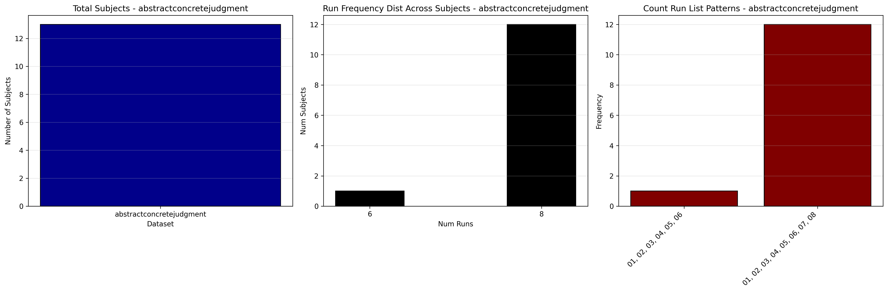

# Dataset Details: ds000051

## Number of Subjects
- BIDS Input: 13

## Tasks and Trial Types
### Task: abstractconcretejudgment
- **Column Names**: onset, duration, trial_type, 0, 1, 2, 3
- **Data Types**: onset (float64), duration (float64), trial_type (object), 0 (object), 1 (object), 2 (float64), 3 (float64)
- **BOLD Volumes**: 200
- **Unique 'trial_type' Values**: Spanish-English-Abstract-Novel, English-English-Abstract-Novel, Spanish-Spanish-Abstract-Novel, English-Spanish-Concrete-Novel, English-Spanish-Abstract-Novel, Spanish-Spanish-Abstract-Repeat, English-English-Abstract-Repeat, English-English-Concrete-Novel, Spanish-Spanish-Concrete-Novel, Spanish-English-Abstract-Repeat, English-Spanish-Abstract-Repeat, English-English-Concrete-Repeat, English-Spanish-Concrete-Repeat, Spanish-Spanish-Concrete-Repeat, Spanish-English-Concrete-Novel, Spanish-English-Concrete-Repeat

**Count Summaries**:

## MRIQC Summary Reports
- [group_T1w.html](https://htmlpreview.github.io/?https://github.com/demidenm/openneuro_glmfitlins/blob/main/statsmodel_specs/ds000051/mriqc_summary/group_T1w.html)
- [group_bold.html](https://htmlpreview.github.io/?https://github.com/demidenm/openneuro_glmfitlins/blob/main/statsmodel_specs/ds000051/mriqc_summary/group_bold.html)
