# ds000105: objectviewing Task Analysis Report

The size of the Fitlins Derivatives for ds000105 objectviewing is 71M with 17276 files.

Dataset- and task-relevant citations may be found in the papers: [Paper 1](https://doi.org/10.1126/science.1063736), [Paper 2](https://doi.org/10.1162/0898929053467550).

## 1. Statistical Analysis [Boilerplate]

The below is an automatically generated report for the statistical analyses performed on this task and dataset. Some reporting standards from the 'Statistical Modeling & Inference' section of the COBIDAS checklist ([Nichols et al., 2017](https://www.nature.com/articles/nn.4500)) are adopted here.

### 1.1. First-level Analysis
For the 6 subjects, whole-brain, mass univariate analyses were performed using a general linear model (GLM). The 8 regressors of interest (out of 9 total regressors) were convolved with a spm hemodynamic response function (see Section 2.3 for list). The design matrix (see example in Section 4.1) included both the convolved regressors of interest and 27 nuisance regressors to account for physiological noise and motion-related artifacts (see Section 2.4 for full list).

**Motion Regressors**: Motion parameters included the six rigid-body parameters estimated during motion correction (three translations, three rotations), their temporal derivatives, and the squares of both the parameters and their derivatives, resulting in 24 motion-related regressors.
**Drift Regressors**: Cosine basis functions implemented a high-pass temporal filter with a cutoff of 128 seconds to remove low-frequency drift in the BOLD signal.

**Model Implementation**: All regressors were included in the subject-level first-level General Linear Model (GLM) using FitLins with the Nilearn estimator. The preprocessed (fMRIPrep) BOLD time series were pre-whitened using an autoregressive AR(1) model to correct for temporal autocorrelation. Spatial smoothing was applied with a 5 mm full-width at half maximum (FWHM) Gaussian kernel (isotropic additive smoothing). Each voxel's timeseries was mean-scaled by the voxel's mean signal value following Nilearn's *FirstLevelModel* default procedure.

Each voxel's timeseries (Y) was regressed onto the resulting design matrix (Xβ), which included the regressors and an intercept term . As illustrated in Section 3, 36 linear contrasts were computed

### 1.2. Model Outputs
For each run and subject, outputs include but are not limited to:
- A complete design matrix for visualization
- Model fit statistics (R-squared and log-likelihood maps)
- For each contrast: effect size maps (beta values), t-statistic maps, z-statistic maps and variance maps

### 1.3. Subject- and Group-level Analyses
**Within-subject combination**: After the GLM was computed for each subjects' run, multiple runs per subject were combined using Nilearn's *compute_fixed_effects* function with precision weighting disabled (`precision_weighted=False`), implementing a fixed-effects model across runs within each subject. **Group-level model**: The resulting subject-level average statistical maps were entered into a random-effects group analysis using a two-sided one-sample t-test against zero to estimate population-level activation patterns. This approach treats subjects as a random effect, allowing inferences to generalize to the broader population. Resulting group maps were not cluster corrected but thresholded at z > 2.3 for display purposes (see section 5). More details and images are provided below. 

## 2. Additional Analytic Details 

### 2.1 BIDS Stats Model Structure
- Run-level models: Yes
- Subject-level models: Yes
- Dataset-level models: Yes 

### 2.2 Regressors of Interest
trial_type.bottle, trial_type.cat, trial_type.chair, trial_type.face, trial_type.house, trial_type.scissors, trial_type.scrambledpix, trial_type.shoe, intercept

### 2.3 Convolved Regressors
trial_type.bottle, trial_type.cat, trial_type.chair, trial_type.face, trial_type.house, trial_type.scissors, trial_type.scrambledpix, trial_type.shoe

### 2.4 Parametrically Modulated Regressors*
None identified

> **Note:** Parametric regressors are auto-identified by excluding: intercept, constant, trial_type.* and duration-assigned variables from non-nuisance regressors.

### 2.5 Nuisance Regressors
trans_x, trans_x_derivative1, trans_x_derivative1_power2, trans_x_power2, trans_y, trans_y_derivative1, trans_y_derivative1_power2, trans_y_power2, trans_z, trans_z_derivative1, trans_z_derivative1_power2, trans_z_power2, rot_x, rot_x_derivative1, rot_x_derivative1_power2, rot_x_power2, rot_y, rot_y_derivative1, rot_y_derivative1_power2, rot_y_power2, rot_z, rot_z_derivative1, rot_z_derivative1_power2, rot_z_power2, cosine00, cosine01, cosine02

## 3 Contrasts of Interest
- **shoe**: 1*`trial_type.shoe`

- **house**: 1*`trial_type.house`

- **chair**: 1*`trial_type.chair`

- **cat**: 1*`trial_type.cat`

- **face**: 1*`trial_type.face`

- **scrambledpix**: 1*`trial_type.scrambledpix`

- **bottle**: 1*`trial_type.bottle`

- **scissors**: 1*`trial_type.scissors`

- **shoevscrambpix**: 1*`trial_type.shoe` - 1*`trial_type.scrambledpix`

- **housevscrambpix**: 1*`trial_type.house` - 1*`trial_type.scrambledpix`

- **chairvscrambdpix**: 1*`trial_type.chair` - 1*`trial_type.scrambledpix`

- **catvscrambpix**: 1*`trial_type.cat` - 1*`trial_type.scrambledpix`

- **facevscrambpix**: 1*`trial_type.face` - 1*`trial_type.scrambledpix`

- **bottlevscrambpix**: 1*`trial_type.bottle` - 1*`trial_type.scrambledpix`

- **scissorsvscrambpix**: 1*`trial_type.scissors` - 1*`trial_type.scrambledpix`

- **shoevhouse**: 1*`trial_type.shoe` - 1*`trial_type.house`

- **shoevchair**: 1*`trial_type.shoe` - 1*`trial_type.chair`

- **shoevcat**: 1*`trial_type.shoe` - 1*`trial_type.cat`

- **shoevface**: 1*`trial_type.shoe` - 1*`trial_type.face`

- **shoevbottle**: 1*`trial_type.shoe` - 1*`trial_type.bottle`

- **shoevsscissors**: 1*`trial_type.shoe` - 1*`trial_type.scissors`

- **housevchair**: 1*`trial_type.house` - 1*`trial_type.chair`

- **housevcat**: 1*`trial_type.house` - 1*`trial_type.cat`

- **housevface**: 1*`trial_type.house` - 1*`trial_type.face`

- **housevbottle**: 1*`trial_type.house` - 1*`trial_type.bottle`

- **housevsscissors**: 1*`trial_type.house` - 1*`trial_type.scissors`

- **chairvcat**: 1*`trial_type.chair` - 1*`trial_type.cat`

- **chairvface**: 1*`trial_type.chair` - 1*`trial_type.face`

- **chairvbottle**: 1*`trial_type.chair` - 1*`trial_type.bottle`

- **chairvsscissors**: 1*`trial_type.chair` - 1*`trial_type.scissors`

- **catvface**: 1*`trial_type.cat` - 1*`trial_type.face`

- **catvbottle**: 1*`trial_type.cat` - 1*`trial_type.bottle`

- **catvsscissors**: 1*`trial_type.cat` - 1*`trial_type.scissors`

- **facevbottle**: 1*`trial_type.face` - 1*`trial_type.bottle`

- **facevsscissors**: 1*`trial_type.face` - 1*`trial_type.scissors`

- **bottlevsscissors**: 1*`trial_type.bottle` - 1*`trial_type.scissors`

# 4 Figures

## 4.1 Design Matrix
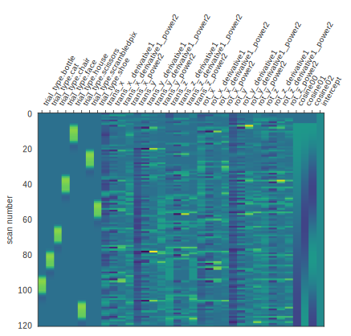

The example design matrix illustrates the model used in the statistical analyses for this task (Note: if motion outliers are included, the number of these will vary between subjects). Each column represents a regressor (of interest or not of interest, based on the above), and each row represents a time point in the BOLD timeseries. The colored patterns show how different experimental conditions are modeled across the scan duration (HRF model).

## 4.2 Contrast Weights
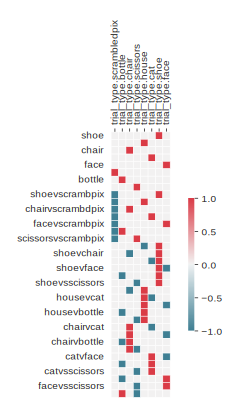

The contrast maps represent the weights used to model brain activity.

## 4.3 Variance Inflation Factor (VIF)

The above includes 1) regressor and 2) contrast VIF estimates. The VIF boxplot quantifies multicollinearity between model regressors and how they impact contrasts (for more on contrasts VIFs, see [Dr. Mumford's repo](https://github.com/jmumford/vif_contrasts)).High VIF (e.g., >5 or >10) indicates that collinearity is inflating the variance at a potentially concerning level, which may lead to outliers.  Data should be queried to assess for outliers (e.g. [fmri-outlier-detector](https://github.com/jmumford/fmri-outlier-detector)). VIFs were estimated using the first-level model design matrices -- nusiance regressors are excluded here for brevity.

## 4.4 Voxelwise Model Variance Explained (r-squared)
Voxelwise R-squared values represent the proportion of variance explained by the model at each voxel in the brain. The R-squared images shown here are calculated across runs, subjects and/or sessions (dependent on data BIDS Stats Model nodes) for the study and task.

### 4.4.1 Voxelwise Average (Mean)
The **mean** R-squared image reflect the average of the R-squared values across all subjects and runs.In other words, the fluctuation in how much variability in the BOLD signal the model explains at a given voxel.

### 4.4.2 Voxelwise Variance (Standard Deviation)
The **standard deviation** (or variance) image provides insights into the variability of model performance.In otherwords, across subjects, runs and/or sessions, how much variability there is in the models ability to explain the BOLD at a given voxel.

#### 4.4.3 Flagged Subjects
The quality assessment pipeline evaluates volumetric data across multiple dimensions to identify problematic datasets. Subjects are flagged using: 

  - Dice Estimate: Similarity coefficient between subject r-squared maps and Target Space MNI152 mask falls below .85 (captures dropout and excess non-brain voxels) 
  - Voxels Outside of Mask: Percentage of voxels outside of the target brain mask is greater than the .10% (liberal threshold due to liberal brain masks in fMRIPrep BOLD, captures mostly non-brain voxels) 

The subjects flagged for objectviewing are:
sub-6_run-10, sub-6_run-11, sub-6_run-12, sub-6_run-4, sub-6_run-6, sub-6_run-7, sub-6_run-8, sub-6_run-9

The distribution for subjects and runs in objectviewing are below. 

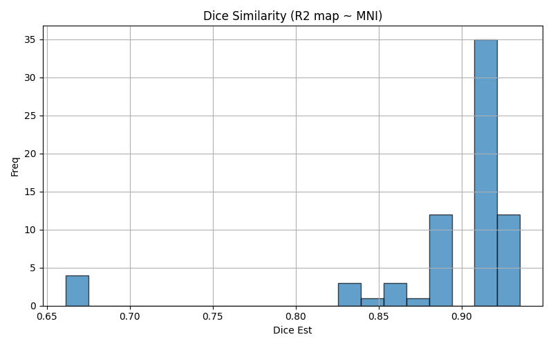
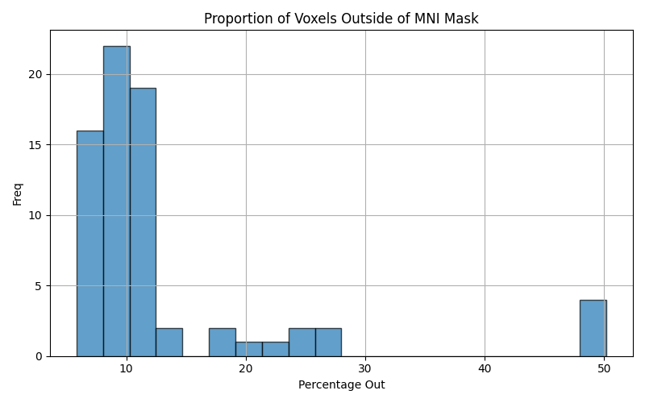

## 5 Statistical Maps

### shoe
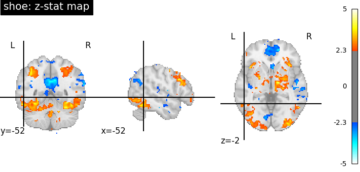

### house
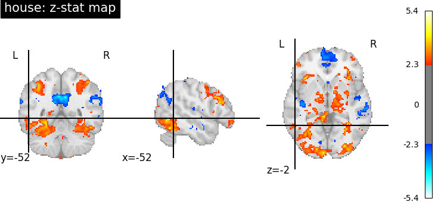

### chair
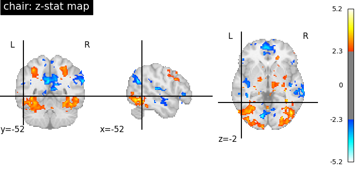

### cat
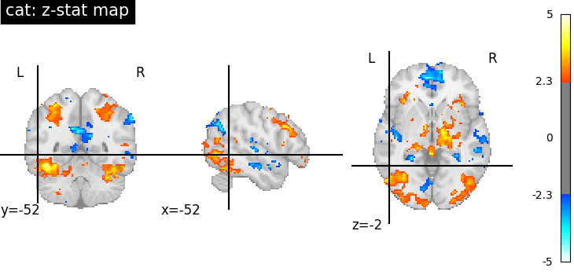

### face
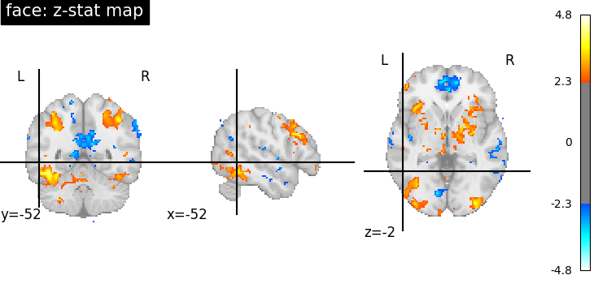

### scrambledpix
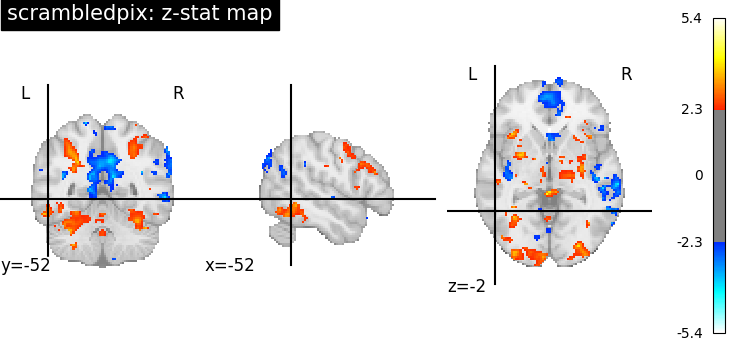

### bottle

### scissors
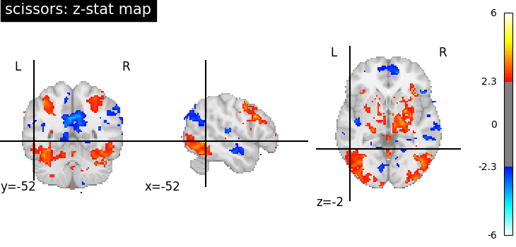

### shoevscrambpix
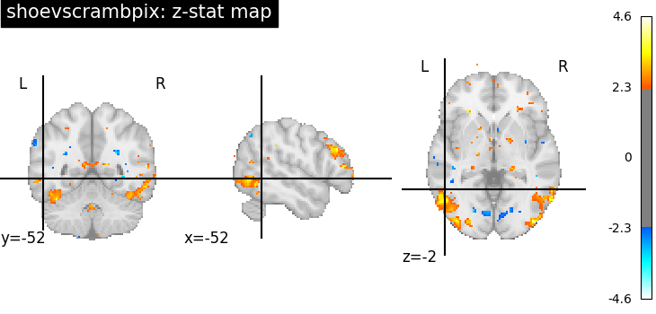

### housevscrambpix
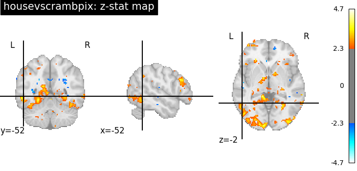

### chairvscrambdpix
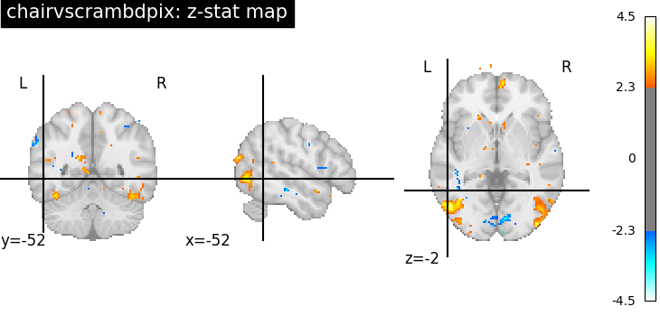

### catvscrambpix
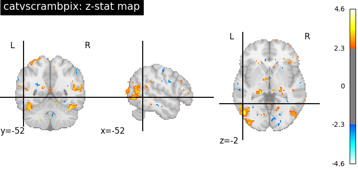

### facevscrambpix
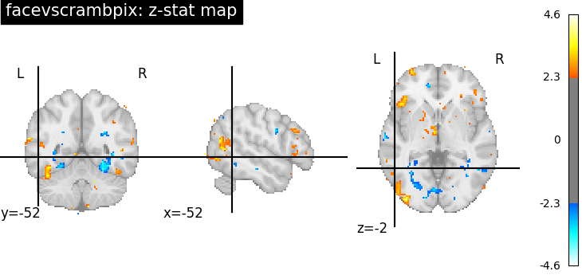

### bottlevscrambpix
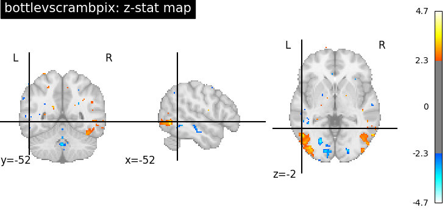

### scissorsvscrambpix
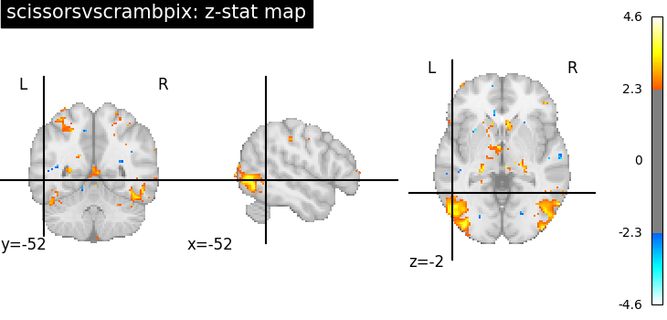

### shoevhouse

### shoevchair
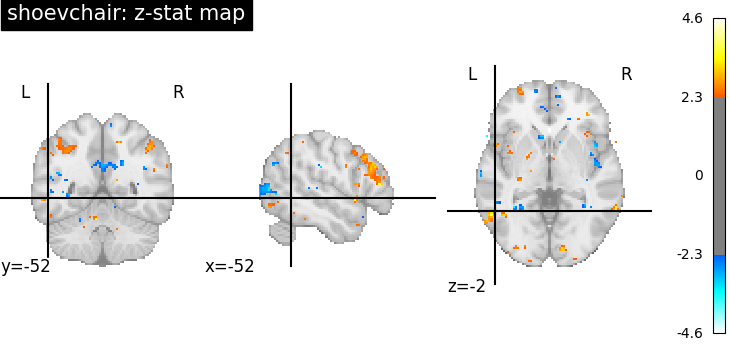

### shoevcat
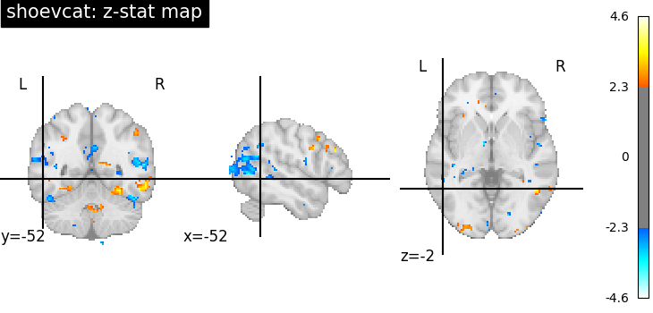

### shoevface
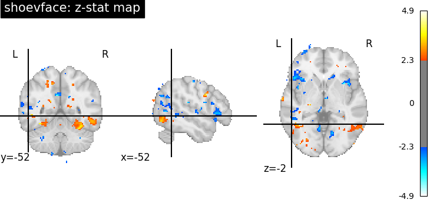

### shoevbottle
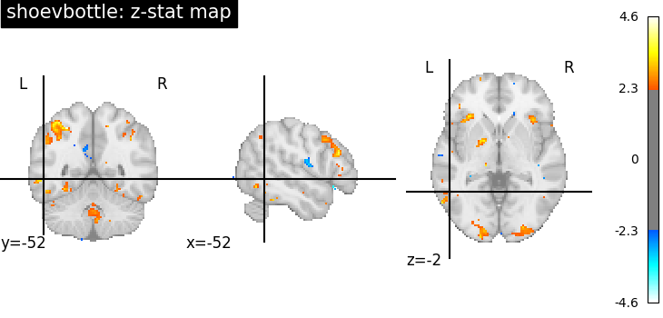

### shoevsscissors
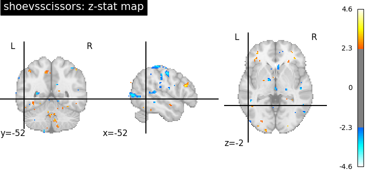

### housevchair
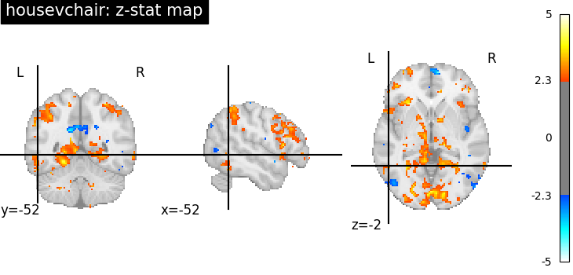

### housevcat
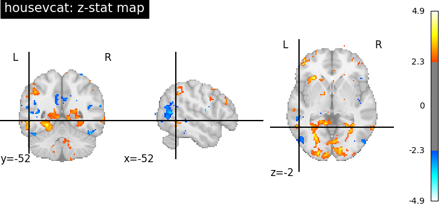

### housevface
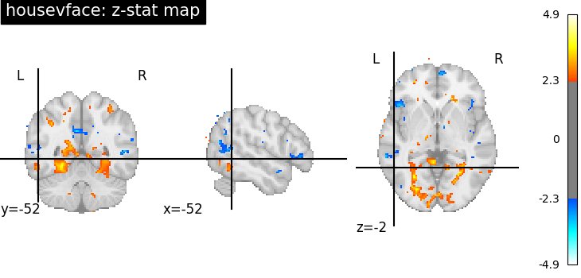

### housevbottle
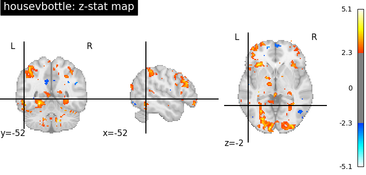

### housevsscissors
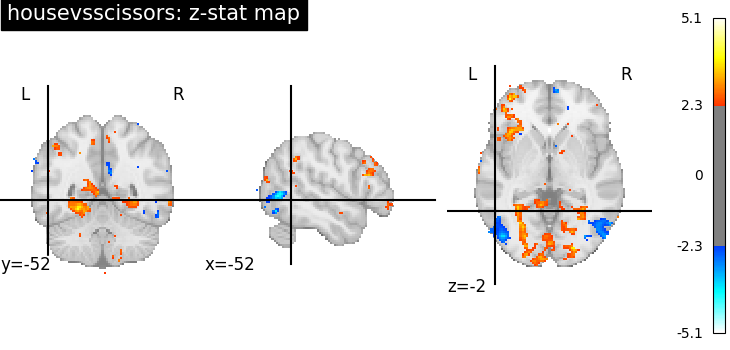

### chairvcat
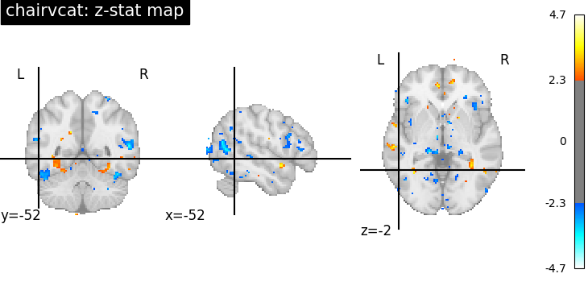

### chairvface

### chairvbottle
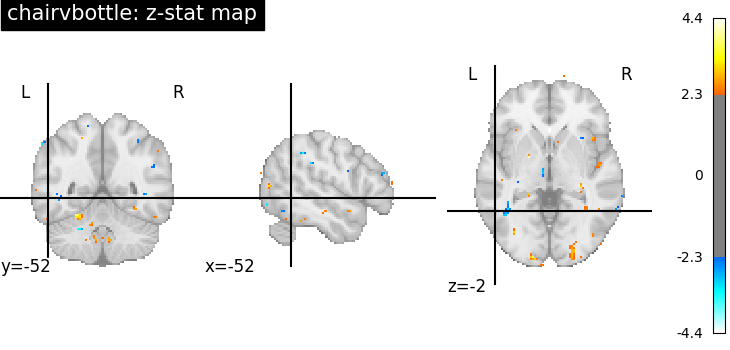

### chairvsscissors
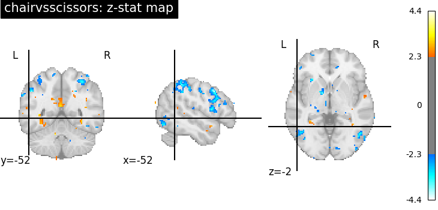

### catvface
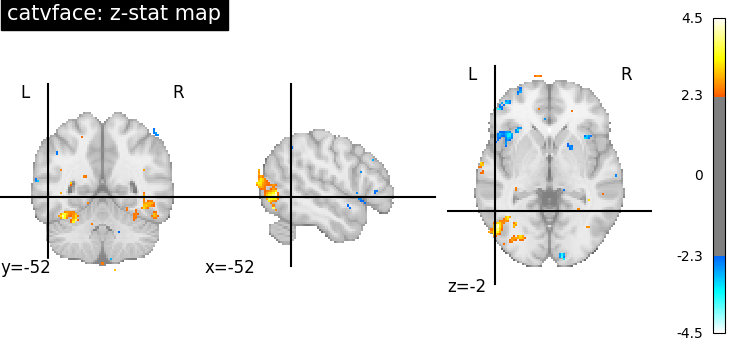

### catvbottle
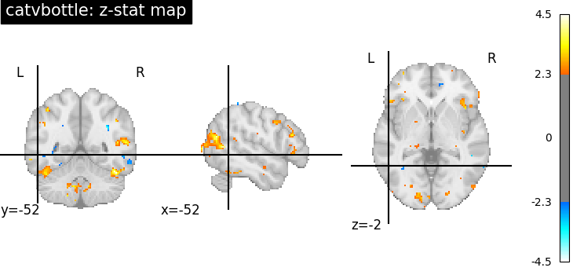

### catvsscissors
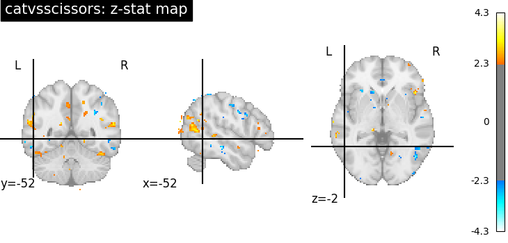

### facevbottle
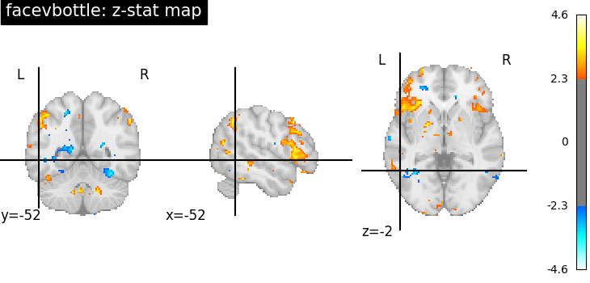

### facevsscissors
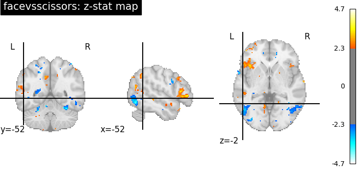

### bottlevsscissors
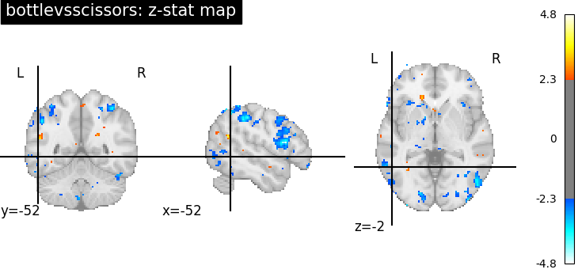
