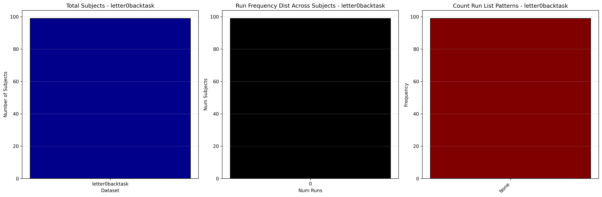
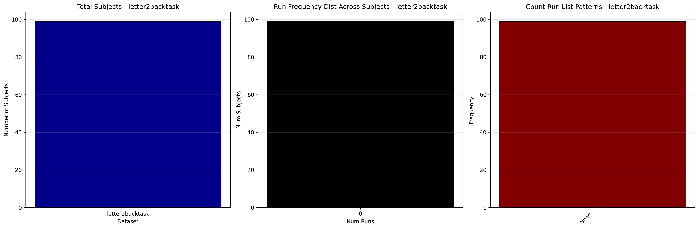

# Dataset Details: ds000115

## Number of Subjects
- BIDS Input: 99

## Tasks and Trial Types
### Task: letter0backtask
- **Column Names**: onset, duration, trial_type, nback-nontarget, response_time
- **Data Types**: onset (float64), duration (float64), trial_type (object), nback-nontarget (float64), response_time (float64)
- **BOLD Volumes**: 137
- **Unique 'trial_type' Values**: nback-nontarget

**Count Summaries**:

### Task: letter1backtask
- **Column Names**: onset, duration, trial_type, nback-nontarget, response_time
- **Data Types**: onset (float64), duration (float64), trial_type (object), nback-nontarget (float64), response_time (float64)
- **BOLD Volumes**: 137
- **Unique 'trial_type' Values**: nback-nontarget

**Count Summaries**:

### Task: letter2backtask
- **Column Names**: onset, duration, trial_type, nback-nontarget, response_time
- **Data Types**: onset (float64), duration (float64), trial_type (object), nback-nontarget (float64), response_time (float64)
- **BOLD Volumes**: 137
- **Unique 'trial_type' Values**: nback-nontarget

**Count Summaries**:

## MRIQC Summary Reports
- [group_T1w.html](https://htmlpreview.github.io/?https://github.com/demidenm/openneuro_glmfitlins/blob/main/statsmodel_specs/ds000115/mriqc_summary/group_T1w.html)
- [group_bold.html](https://htmlpreview.github.io/?https://github.com/demidenm/openneuro_glmfitlins/blob/main/statsmodel_specs/ds000115/mriqc_summary/group_bold.html)
