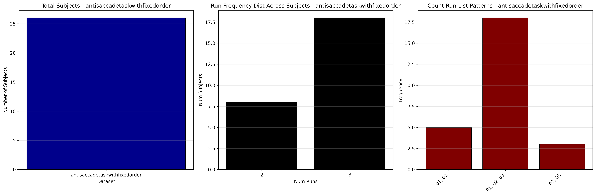

# Dataset Details: ds000120

## Number of Subjects
- BIDS Input: 26

## Tasks and Trial Types
### Task: antisaccadetaskwithfixedorder
- **Column Names**: onset, duration, trial_type, trial_phase, score, score_txt, stim_dot_position, targetxdat, latency, eptrno
- **Data Types**: onset (float64), duration (float64), trial_type (object), trial_phase (object), score (float64), score_txt (object), stim_dot_position (float64), targetxdat (int64), latency (float64), eptrno (int64)
- **BOLD Volumes**: 216
- **Unique 'trial_type' Values**: neutral, reward, vgs

**Count Summaries**:

## MRIQC Summary Reports
- [group_T1w.html](https://htmlpreview.github.io/?https://github.com/demidenm/openneuro_glmfitlins/blob/main/statsmodel_specs/ds000120/mriqc_summary/group_T1w.html)
- [group_bold.html](https://htmlpreview.github.io/?https://github.com/demidenm/openneuro_glmfitlins/blob/main/statsmodel_specs/ds000120/mriqc_summary/group_bold.html)
