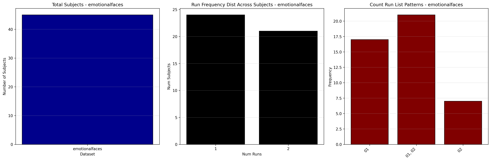

# Dataset Details: ds000144

## Number of Subjects
- BIDS Input: 45

## Tasks and Trial Types
### Task: emotionalfaces
- **Column Names**: onset, duration, stim_emotion
- **Data Types**: onset (int64), duration (int64), stim_emotion (object)
- **BOLD Volumes**: 115
- **Unique 'trial_type' Values**: None

**Count Summaries**:

## MRIQC Summary Reports
- [group_T1w.html](https://htmlpreview.github.io/?https://github.com/demidenm/openneuro_glmfitlins/blob/main/statsmodel_specs/ds000144/mriqc_summary/group_T1w.html)
- [group_bold.html](https://htmlpreview.github.io/?https://github.com/demidenm/openneuro_glmfitlins/blob/main/statsmodel_specs/ds000144/mriqc_summary/group_bold.html)
