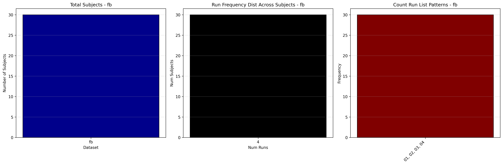

# Dataset Details: ds000212
Note: Only running DIS and FB tasks, given low Ns in other tasks. Furthermore, events labels for FB task are unclear. Simplified to 'belief' and 'photo' conditions until data owners can contribute further details. 

## Number of Subjects
- BIDS Input: 39

## Tasks and Trial Types
### Task: dis
- **Column Names**: onset, duration, condition, item, key, RT
- **Data Types**: onset (int64), duration (int64), condition (object), item (int64), key (int64), RT (float64)
- **BOLD Volumes**: 166
- **Unique 'trial_type' Values**: None

**Count Summaries**:

### Task: fb
- **Column Names**: onset, duration, condition, item, key, RT
- **Data Types**: onset (int64), duration (int64), condition (object), item (int64), key (int64), RT (float64)
- **BOLD Volumes**: 136
- **Unique 'trial_type' Values**: None

**Count Summaries**:

### Task: tom
- **Column Names**: onset, duration, condition, item, key, RT
- **Data Types**: onset (object), duration (int64), condition (object), item (int64), key (int64), RT (float64)
- **BOLD Volumes**: 136
- **Unique 'trial_type' Values**: None

**Count Summaries**:

### Task: tomloc
- **Column Names**: onset, duration, condition, item, key, RT
- **Data Types**: onset (object), duration (int64), condition (object), item (int64), key (int64), RT (float64)
- **BOLD Volumes**: 136
- **Unique 'trial_type' Values**: None

**Count Summaries**:

## MRIQC Summary Reports
- [group_T1w.html](https://htmlpreview.github.io/?https://github.com/demidenm/openneuro_glmfitlins/blob/main/statsmodel_specs/ds000212/mriqc_summary/group_T1w.html)
- [group_bold.html](https://htmlpreview.github.io/?https://github.com/demidenm/openneuro_glmfitlins/blob/main/statsmodel_specs/ds000212/mriqc_summary/group_bold.html)
