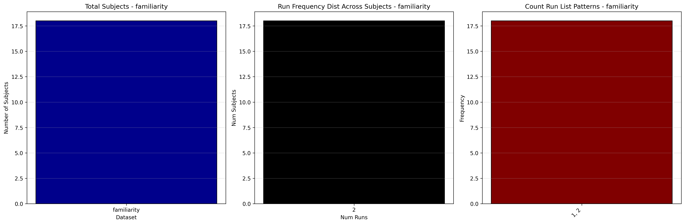
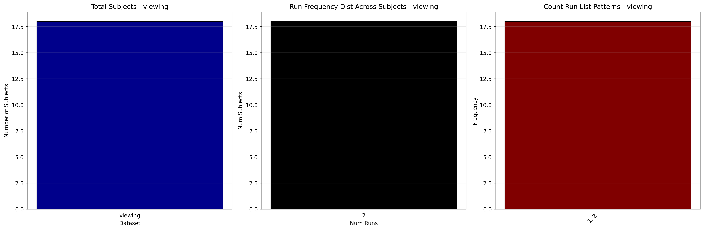

# Dataset Details: ds001357

## Number of Subjects
- BIDS Input: 18

## Tasks and Trial Types
### Task: familiarity
- **Column Names**: onset,  duration,  events, Unnamed: 3
- **Data Types**: onset (float64),  duration (float64),  events (object), Unnamed: 3 (float64)
- **BOLD Volumes**: 246
- **Unique 'trial_type' Values**: None

**Count Summaries**:

### Task: viewing
- **Column Names**: onset,  duration,  events, Unnamed: 3
- **Data Types**: onset (int64),  duration (float64),  events (object), Unnamed: 3 (float64)
- **BOLD Volumes**: 326
- **Unique 'trial_type' Values**: None

**Count Summaries**:

## MRIQC Summary Reports
- [group_T1w.html](https://htmlpreview.github.io/?https://github.com/demidenm/openneuro_glmfitlins/blob/main/statsmodel_specs/ds001357/mriqc_summary/group_T1w.html)
- [group_bold.html](https://htmlpreview.github.io/?https://github.com/demidenm/openneuro_glmfitlins/blob/main/statsmodel_specs/ds001357/mriqc_summary/group_bold.html)
