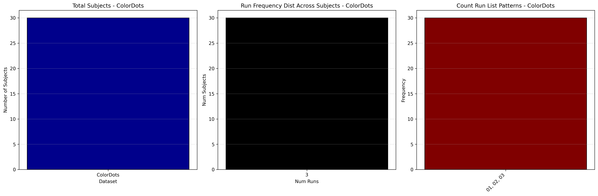
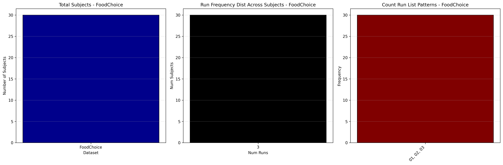
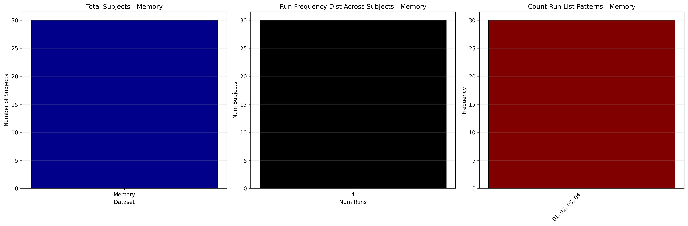

# Dataset Details: ds002006

## Number of Subjects
- BIDS Input: 30

## Tasks and Trial Types
### Task: ColorDots
- **Column Names**: onset, duration, TRIALTYPE, COHERENCE, RESPONSE_TIME, BUTTON_ORDER, CHOSE_RIGHT
- **Data Types**: onset (float64), duration (float64), TRIALTYPE (object), COHERENCE (float64), RESPONSE_TIME (float64), BUTTON_ORDER (int64), CHOSE_RIGHT (float64)
- **BOLD Volumes**: 197
- **Unique 'trial_type' Values**: None

**Count Summaries**:

### Task: FoodChoice
- **Column Names**: onset, duration, TRIALTYPE, DELTAVALUE, RESPONSE_TIME, MEAN_VALUE, VALUE_RIGHT, VALUE_LEFT, CHOSE_RIGHT
- **Data Types**: onset (float64), duration (float64), TRIALTYPE (object), DELTAVALUE (float64), RESPONSE_TIME (float64), MEAN_VALUE (float64), VALUE_RIGHT (float64), VALUE_LEFT (float64), CHOSE_RIGHT (float64)
- **BOLD Volumes**: 212
- **Unique 'trial_type' Values**: None

**Count Summaries**:

### Task: Memory
- **Column Names**: onset, duration, TRIALTYPE, LIKING_RATING, RESPONSE_TIME, OLD_ON_LEFT, ITEM_ISOLD, CHOSE_RIGHT
- **Data Types**: onset (float64), duration (float64), TRIALTYPE (object), LIKING_RATING (float64), RESPONSE_TIME (float64), OLD_ON_LEFT (int64), ITEM_ISOLD (int64), CHOSE_RIGHT (float64)
- **BOLD Volumes**: 150
- **Unique 'trial_type' Values**: None

**Count Summaries**:

## MRIQC Summary Reports
- [group_T1w.html](https://htmlpreview.github.io/?https://github.com/demidenm/openneuro_glmfitlins/blob/main/statsmodel_specs/ds002006/mriqc_summary/group_T1w.html)
- [group_bold.html](https://htmlpreview.github.io/?https://github.com/demidenm/openneuro_glmfitlins/blob/main/statsmodel_specs/ds002006/mriqc_summary/group_bold.html)
