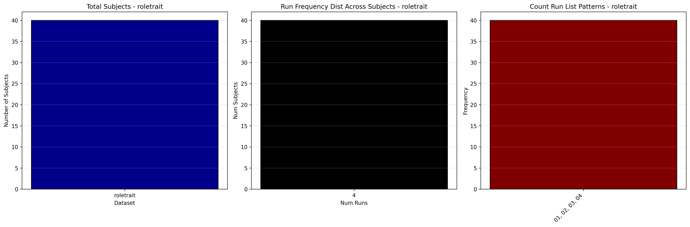

# Dataset Details: ds002294

## Number of Subjects
- BIDS Input: 40

## Tasks and Trial Types
### Task: roletrait
- **Column Names**: onset, duration, Subject, sample, trial_type, response_time, stimulus, run
- **Data Types**: onset (float64), duration (int64), Subject (int64), sample (int64), trial_type (object), response_time (float64), stimulus (object), run (int64)
- **BOLD Volumes**: 352
- **Unique 'trial_type' Values**: friendGroupBlock, selfGroupBlock, friendTraitBlock, selfTraitBlock, selfRoleBlock, friendRoleBlock

**Count Summaries**:

## MRIQC Summary Reports
- [group_T1w.html](https://htmlpreview.github.io/?https://github.com/demidenm/openneuro_glmfitlins/blob/main/statsmodel_specs/ds002294/mriqc_summary/group_T1w.html)
- [group_bold.html](https://htmlpreview.github.io/?https://github.com/demidenm/openneuro_glmfitlins/blob/main/statsmodel_specs/ds002294/mriqc_summary/group_bold.html)
