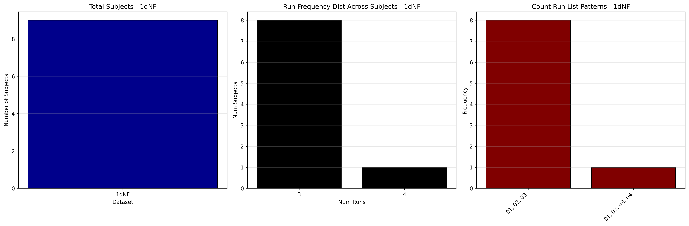
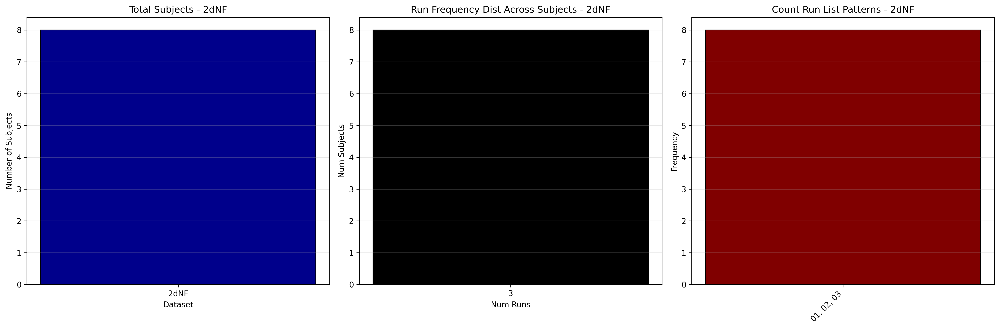
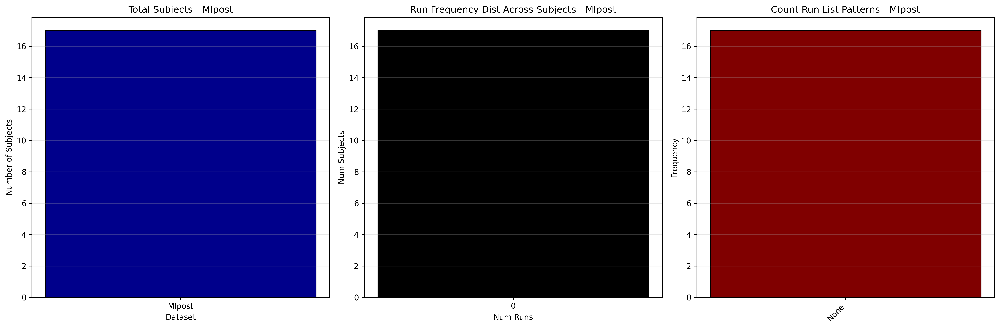
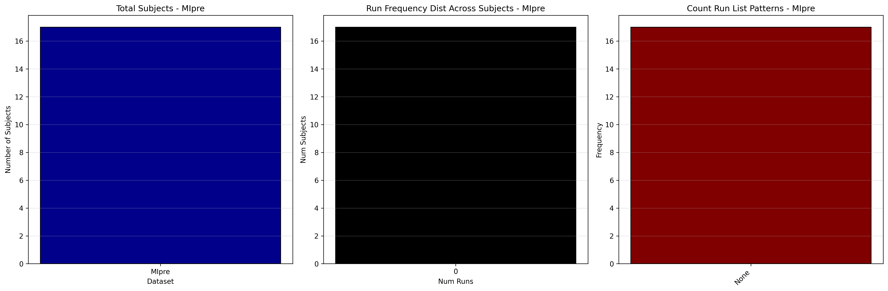

# Dataset Details: ds002338

## Number of Subjects
- BIDS Input: 17

## Tasks and Trial Types
### Task: 1dNF
- **Column Names**: onset, duration, trial_type, stim_file
- **Data Types**: onset (int64), duration (int64), trial_type (object), stim_file (object)
- **BOLD Volumes**: 332
- **Unique 'trial_type' Values**: Rest, Task-NF

**Count Summaries**:

### Task: 2dNF
- **Column Names**: onset, duration, trial_type, stim_file
- **Data Types**: onset (int64), duration (int64), trial_type (object), stim_file (object)
- **BOLD Volumes**: 332
- **Unique 'trial_type' Values**: Rest, Task-NF

**Count Summaries**:

### Task: MIpost
- **Column Names**: onset, duration, trial_type, stim_file
- **Data Types**: onset (int64), duration (int64), trial_type (object), stim_file (object)
- **BOLD Volumes**: 332
- **Unique 'trial_type' Values**: Rest, Task-MI

**Count Summaries**:

### Task: MIpre
- **Column Names**: onset, duration, trial_type, stim_file
- **Data Types**: onset (int64), duration (int64), trial_type (object), stim_file (object)
- **BOLD Volumes**: 332
- **Unique 'trial_type' Values**: Rest, Task-MI

**Count Summaries**:

## MRIQC Summary Reports
- [group_T1w.html](https://htmlpreview.github.io/?https://github.com/demidenm/openneuro_glmfitlins/blob/main/statsmodel_specs/ds002338/mriqc_summary/group_T1w.html)
- [group_bold.html](https://htmlpreview.github.io/?https://github.com/demidenm/openneuro_glmfitlins/blob/main/statsmodel_specs/ds002338/mriqc_summary/group_bold.html)
