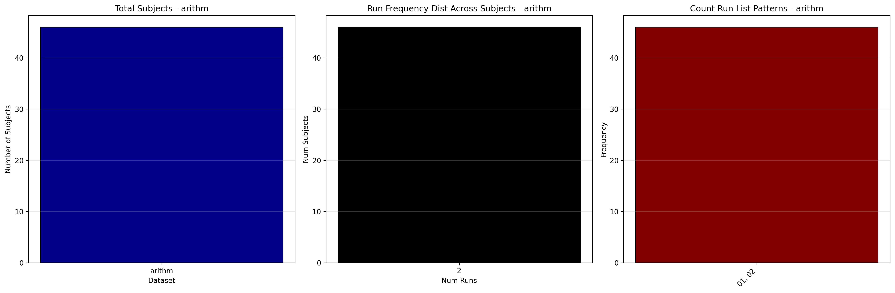

# Dataset Details: ds002422

## Number of Subjects
- BIDS Input: 46

## Tasks and Trial Types
### Task: arithm
- **Column Names**: onset, duration, trial_type
- **Data Types**: onset (float64), duration (float64), trial_type (object)
- **BOLD Volumes**: 210
- **Unique 'trial_type' Values**: control_condition, main_condition

**Count Summaries**:

## MRIQC Summary Reports
- [group_T1w.html](https://htmlpreview.github.io/?https://github.com/demidenm/openneuro_glmfitlins/blob/main/statsmodel_specs/ds002422/mriqc_summary/group_T1w.html)
- [group_bold.html](https://htmlpreview.github.io/?https://github.com/demidenm/openneuro_glmfitlins/blob/main/statsmodel_specs/ds002422/mriqc_summary/group_bold.html)
