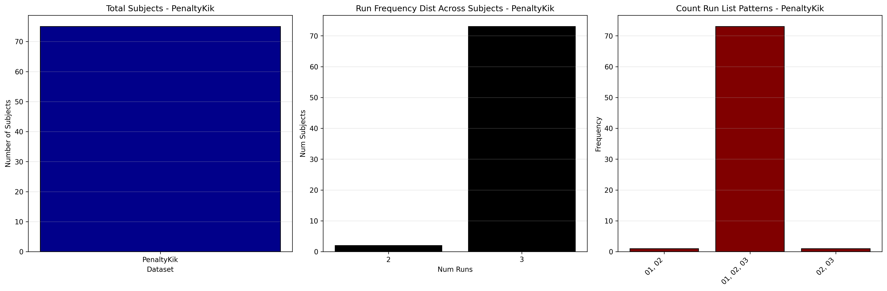

# Dataset Details: ds003345

## Number of Subjects
- BIDS Input: 75

## Tasks and Trial Types
### Task: PenaltyKik
- **Column Names**: onset, duration, trial_type, stim_info, response_time
- **Data Types**: onset (float64), duration (float64), trial_type (object), stim_info (object), response_time (float64)
- **BOLD Volumes**: 364
- **Unique 'trial_type' Values**: Human, CPU

**Count Summaries**:

## MRIQC Summary Reports
- [group_T1w.html](https://htmlpreview.github.io/?https://github.com/demidenm/openneuro_glmfitlins/blob/main/statsmodel_specs/ds003345/mriqc_summary/group_T1w.html)
- [group_bold.html](https://htmlpreview.github.io/?https://github.com/demidenm/openneuro_glmfitlins/blob/main/statsmodel_specs/ds003345/mriqc_summary/group_bold.html)
