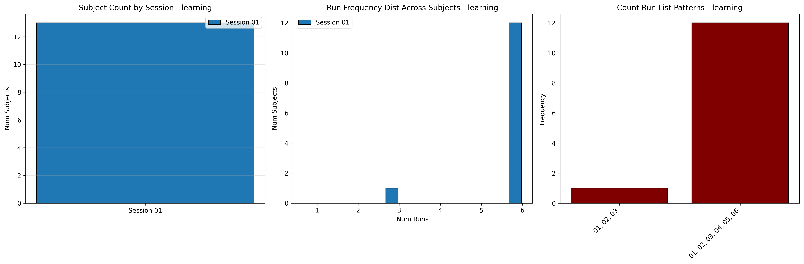
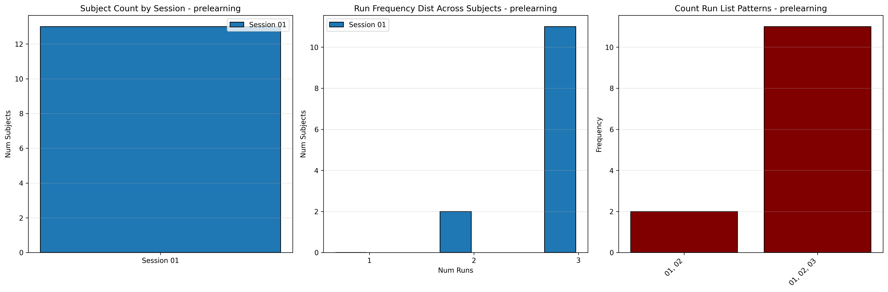
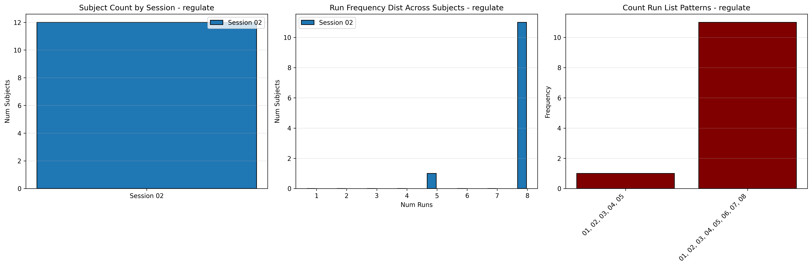
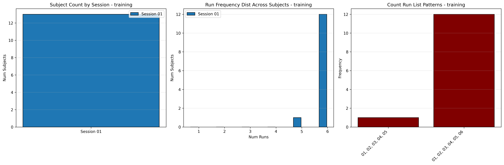

# Dataset Details: ds003425

## Number of Subjects
- BIDS Input: 13

## Sessions
- Sessions: 01, 02

## Tasks and Trial Types
### Task: learning
- **Column Names**: onset, duration, trial_type
- **Data Types**: onset (float64), duration (float64), trial_type (int64)
- **BOLD Volumes**: 98
- **Unique 'trial_type' Values**: 4, 1, 2, 3, 5

**Count Summaries**:

### Task: prelearning
- **Column Names**: onset, duration, trial_type
- **Data Types**: onset (float64), duration (float64), trial_type (int64)
- **BOLD Volumes**: 98
- **Unique 'trial_type' Values**: 5, 3, 4, 2

**Count Summaries**:

### Task: regulate
- **Column Names**: onset, duration, trial_type
- **Data Types**: onset (float64), duration (float64), trial_type (int64)
- **BOLD Volumes**: 125
- **Unique 'trial_type' Values**: 4, 1, 3, 2, 5

**Count Summaries**:

### Task: training
- **Column Names**: onset, duration, trial_type
- **Data Types**: onset (float64), duration (float64), trial_type (int64)
- **BOLD Volumes**: 97
- **Unique 'trial_type' Values**: 2, 1

**Count Summaries**:

## MRIQC Summary Reports
- [group_T1w.html](https://htmlpreview.github.io/?https://github.com/demidenm/openneuro_glmfitlins/blob/main/statsmodel_specs/ds003425/mriqc_summary/group_T1w.html)
- [group_bold.html](https://htmlpreview.github.io/?https://github.com/demidenm/openneuro_glmfitlins/blob/main/statsmodel_specs/ds003425/mriqc_summary/group_bold.html)
