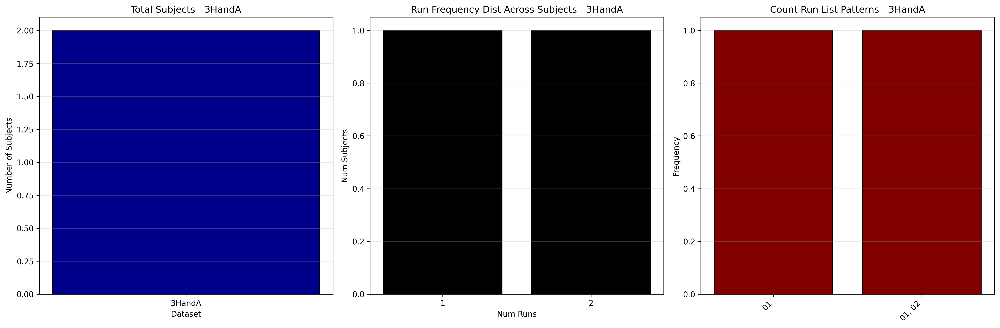
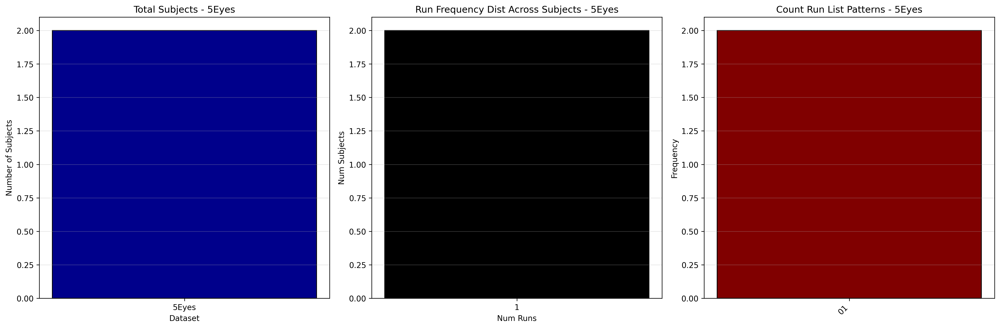

# Dataset Details: ds003441

## Number of Subjects
- BIDS Input: 2

## Tasks and Trial Types
### Task: 1Norm
- **Column Names**: onset, duration, trial_type
- **Data Types**: onset (int64), duration (int64), trial_type (object)
- **BOLD Volumes**: 340
- **Unique 'trial_type' Values**: Hand, Face

**Count Summaries**:

### Task: 2Swallow
- **Column Names**: onset, duration, trial_type
- **Data Types**: onset (int64), duration (int64), trial_type (object)
- **BOLD Volumes**: 340
- **Unique 'trial_type' Values**: Hand, Swallow, Face

**Count Summaries**:

### Task: 3HandA
- **Column Names**: onset, duration, trial_type
- **Data Types**: onset (int64), duration (int64), trial_type (object)
- **BOLD Volumes**: 336
- **Unique 'trial_type' Values**: Hand, TouchingShoulder, ChangeHandPosition, Face

**Count Summaries**:

### Task: 4HandB
- **Column Names**: onset, duration, trial_type
- **Data Types**: onset (int64), duration (int64), trial_type (object)
- **BOLD Volumes**: 336
- **Unique 'trial_type' Values**: Hand, Face, TouchingShoulder, ChangeHandPosition

**Count Summaries**:

### Task: 5Eyes
- **Column Names**: onset, duration, trial_type
- **Data Types**: onset (int64), duration (int64), trial_type (object)
- **BOLD Volumes**: 336
- **Unique 'trial_type' Values**: EyesCenter, Hand, Face, EyesLeft, EyeMovement, EyesRight

**Count Summaries**:

### Task: 6DeepBreathing
- **Column Names**: onset, duration, trial_type
- **Data Types**: onset (int64), duration (int64), trial_type (object)
- **BOLD Volumes**: 336
- **Unique 'trial_type' Values**: Hand, Face

**Count Summaries**:

## MRIQC Summary Reports
- [group_T1w.html](https://htmlpreview.github.io/?https://github.com/demidenm/openneuro_glmfitlins/blob/main/statsmodel_specs/ds003441/mriqc_summary/group_T1w.html)
- [group_bold.html](https://htmlpreview.github.io/?https://github.com/demidenm/openneuro_glmfitlins/blob/main/statsmodel_specs/ds003441/mriqc_summary/group_bold.html)
