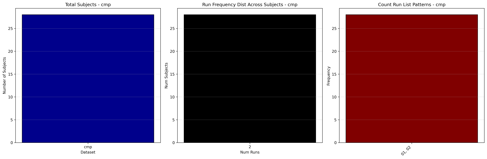
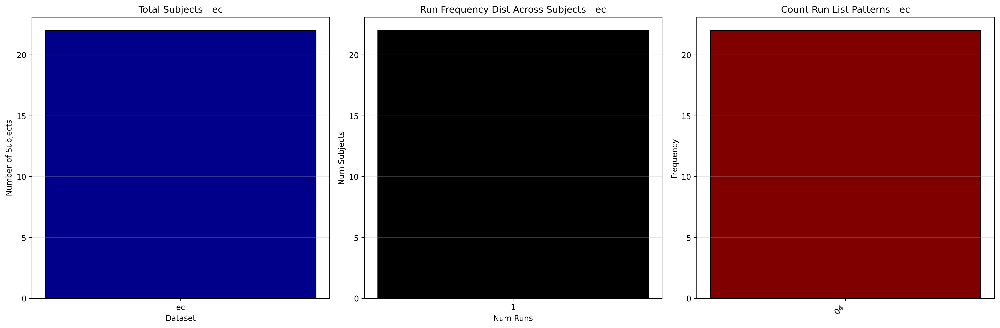
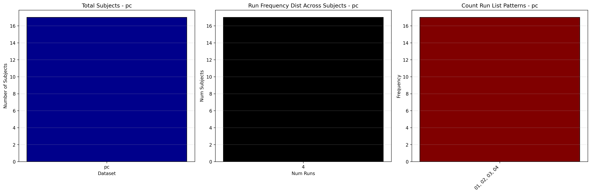
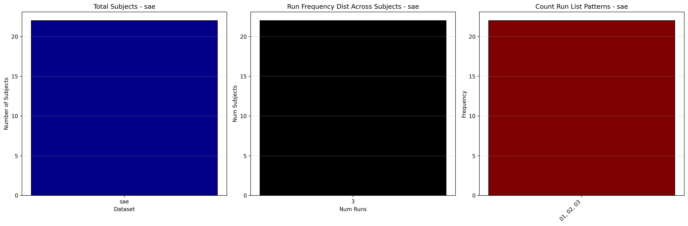
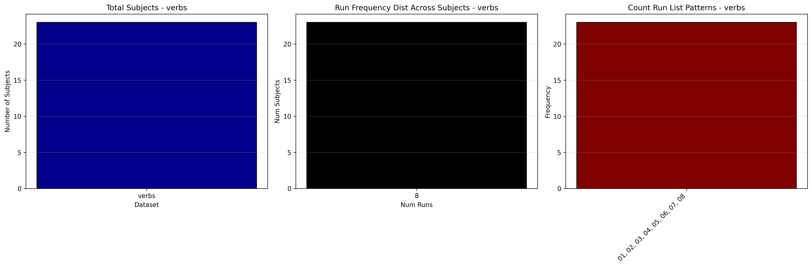

# Dataset Details: ds003481

## Number of Subjects
- BIDS Input: 145

## Tasks and Trial Types
### Task: cmp
- **Column Names**: onset, duration, trial_type
- **Data Types**: onset (float64), duration (float64), trial_type (object)
- **BOLD Volumes**: 250
- **Unique 'trial_type' Values**: Literal, Metafora, Absurdo

**Count Summaries**:

### Task: ec
- **Column Names**: onset, duration, trial_type
- **Data Types**: onset (int64), duration (float64), trial_type (object)
- **BOLD Volumes**: 150
- **Unique 'trial_type' Values**: Alegría, Tristeza, Enojo, Sin_Rostro

**Count Summaries**:

### Task: pc
- **Column Names**: onset, duration, trial_type
- **Data Types**: onset (float64), duration (float64), trial_type (object)
- **BOLD Volumes**: 231
- **Unique 'trial_type' Values**: Literal, Pregunta, Familiar, Novedoso

**Count Summaries**:

### Task: sae
- **Column Names**: onset, duration, trial_type
- **Data Types**: onset (float64), duration (float64), trial_type (object)
- **BOLD Volumes**: 242
- **Unique 'trial_type' Values**: Enojo, Alegría, Tristeza, SinRostro

**Count Summaries**:

### Task: sar
- **Column Names**: onset, duration, trial_type
- **Data Types**: onset (float64), duration (float64), trial_type (object)
- **BOLD Volumes**: 261
- **Unique 'trial_type' Values**: ah, controlYES, controlNO, controlNo, controlYes

**Count Summaries**:

### Task: verbs
- **Column Names**: onset, duration, trial_type
- **Data Types**: onset (int64), duration (int64), trial_type (object)
- **BOLD Volumes**: 174
- **Unique 'trial_type' Values**: mental, pseudo, motor, symbol, mental 

**Count Summaries**:

## MRIQC Summary Reports
- [group_T1w.html](https://htmlpreview.github.io/?https://github.com/demidenm/openneuro_glmfitlins/blob/main/statsmodel_specs/ds003481/mriqc_summary/group_T1w.html)
- [group_bold.html](https://htmlpreview.github.io/?https://github.com/demidenm/openneuro_glmfitlins/blob/main/statsmodel_specs/ds003481/mriqc_summary/group_bold.html)
