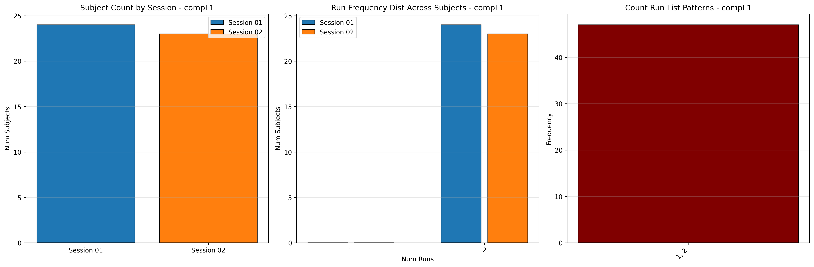
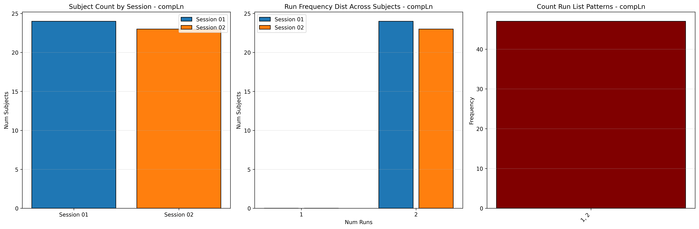

# Dataset Details: ds003545

## Number of Subjects
- BIDS Input: 24

## Sessions
- Sessions: 01, 02

## Tasks and Trial Types
### Task: compL1
- **Column Names**: onset, duration, trial_type, correct
- **Data Types**: onset (float64), duration (int64), trial_type (int64), correct (int64)
- **BOLD Volumes**: 186
- **Unique 'trial_type' Values**: 3, 2, 1

**Count Summaries**:

### Task: compLn
- **Column Names**: onset, duration, trial_type, correct
- **Data Types**: onset (float64), duration (int64), trial_type (int64), correct (int64)
- **BOLD Volumes**: 186
- **Unique 'trial_type' Values**: 3, 1, 2

**Count Summaries**:

### Task: prodL1
- **Column Names**: onset, duration, trial_type
- **Data Types**: onset (float64), duration (int64), trial_type (int64)
- **BOLD Volumes**: 242
- **Unique 'trial_type' Values**: 1, 2, 4, 3, 5

**Count Summaries**:

### Task: prodLn
- **Column Names**: onset, duration, trial_type
- **Data Types**: onset (float64), duration (int64), trial_type (int64)
- **BOLD Volumes**: 243
- **Unique 'trial_type' Values**: 1, 2, 4, 3, 5

**Count Summaries**:

## MRIQC Summary Reports
- [group_T1w.html](https://htmlpreview.github.io/?https://github.com/demidenm/openneuro_glmfitlins/blob/main/statsmodel_specs/ds003545/mriqc_summary/group_T1w.html)
- [group_bold.html](https://htmlpreview.github.io/?https://github.com/demidenm/openneuro_glmfitlins/blob/main/statsmodel_specs/ds003545/mriqc_summary/group_bold.html)
