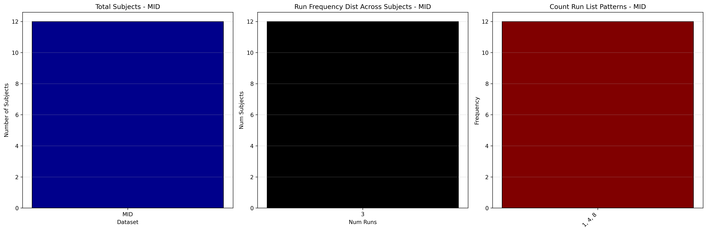

# Dataset Details: ds003858

  NOTE: The run-level data are associated with different acquisitions types (single slice, multi-band 4, multi-band 8). These aren't indicated by sessions or task entities, but by run entities (e.g. run-1, run-4, run-4). Update runs and subject-level in spec files to avoid issues.

## Number of Subjects
- BIDS Input: 12

## Tasks and Trial Types
### Task: MID
- **Column Names**: onset, duration, trial, trial_type, target_s, response_time, hit, total_gain, iti
- **Data Types**: onset (float64), duration (int64), trial (int64), trial_type (object), target_s (float64), response_time (float64), hit (int64), total_gain (object), iti (int64)
- **BOLD Volumes**: 442
- **Unique 'trial_type' Values**: -$0, -$1, +$0, +$5, -$5, +$1, $0, ($1), $5, ($5), $1

**Count Summaries**:

## MRIQC Summary Reports
- [group_T1w.html](https://htmlpreview.github.io/?https://github.com/demidenm/openneuro_glmfitlins/blob/main/statsmodel_specs/ds003858/mriqc_summary/group_T1w.html)
- [group_bold.html](https://htmlpreview.github.io/?https://github.com/demidenm/openneuro_glmfitlins/blob/main/statsmodel_specs/ds003858/mriqc_summary/group_bold.html)
