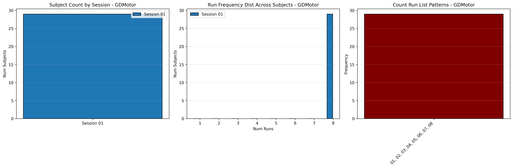

# Dataset Details: ds004056

## Number of Subjects
- BIDS Input: 29

## Sessions
- Sessions: 01, 02

## Tasks and Trial Types
### Task: GDMotor
- **Column Names**: onset, duration, trial_type
- **Data Types**: onset (float64), duration (int64), trial_type (object)
- **BOLD Volumes**: 367
- **Unique 'trial_type' Values**: Inst_VM, DOOR-VM-no-go, Inst_CON, DOOR-CON, Inst_VG, DOOR-VG-go, DOOR-VM-go, DOOR-VG-no-go

**Count Summaries**:

## MRIQC Summary Reports
- [group_T1w.html](https://htmlpreview.github.io/?https://github.com/demidenm/openneuro_glmfitlins/blob/main/statsmodel_specs/ds004056/mriqc_summary/group_T1w.html)
- [group_T2w.html](https://htmlpreview.github.io/?https://github.com/demidenm/openneuro_glmfitlins/blob/main/statsmodel_specs/ds004056/mriqc_summary/group_T2w.html)
- [group_bold.html](https://htmlpreview.github.io/?https://github.com/demidenm/openneuro_glmfitlins/blob/main/statsmodel_specs/ds004056/mriqc_summary/group_bold.html)
