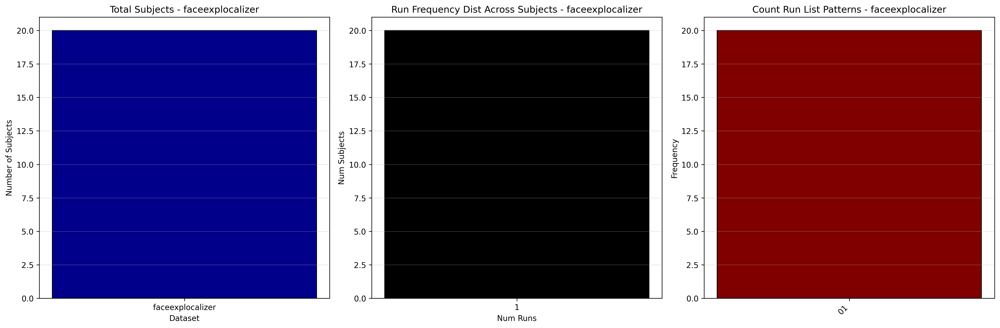
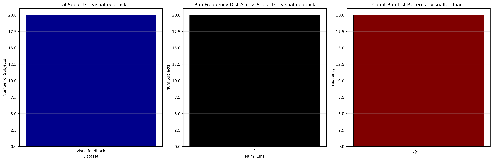

# Dataset Details: ds004141

## Number of Subjects
- BIDS Input: 20

## Tasks and Trial Types
### Task: auditoryfeedback
- **Column Names**: onset, duration, trial_type
- **Data Types**: onset (float64), duration (float64), trial_type (object)
- **BOLD Volumes**: 300
- **Unique 'trial_type' Values**: Neutral, Happy, Sad, Alternate

**Count Summaries**:

### Task: faceexplocalizer
- **Column Names**: onset, duration, trial_type
- **Data Types**: onset (float64), duration (float64), trial_type (object)
- **BOLD Volumes**: 160
- **Unique 'trial_type' Values**: Alternate, Sad, Neutral, Movement, Happy

**Count Summaries**:

### Task: nofeedback
- **Column Names**: onset, duration, trial_type
- **Data Types**: onset (float64), duration (float64), trial_type (object)
- **BOLD Volumes**: 300
- **Unique 'trial_type' Values**: Neutral, Sad, Happy, Alternate

**Count Summaries**:

### Task: visualfeedback
- **Column Names**: onset, duration, trial_type
- **Data Types**: onset (float64), duration (float64), trial_type (object)
- **BOLD Volumes**: 300
- **Unique 'trial_type' Values**: Neutral, Alternate, Sad, Happy

**Count Summaries**:

## MRIQC Summary Reports
- [group_T1w.html](https://htmlpreview.github.io/?https://github.com/demidenm/openneuro_glmfitlins/blob/main/statsmodel_specs/ds004141/mriqc_summary/group_T1w.html)
- [group_bold.html](https://htmlpreview.github.io/?https://github.com/demidenm/openneuro_glmfitlins/blob/main/statsmodel_specs/ds004141/mriqc_summary/group_bold.html)
