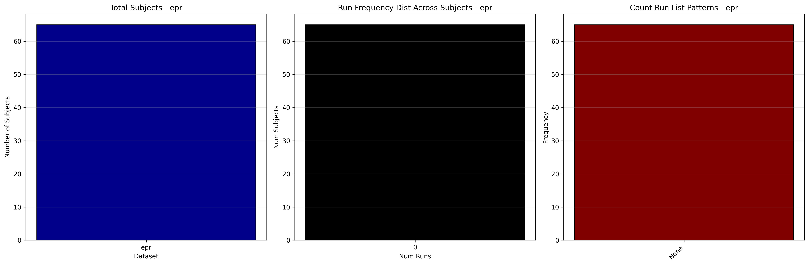

# Dataset Details: ds004144

## Number of Subjects
- BIDS Input: 66

## Tasks and Trial Types
### Task: epr
- **Column Names**: onset, duration, trial_type
- **Data Types**: onset (float64), duration (int64), trial_type (object)
- **BOLD Volumes**: 775
- **Unique 'trial_type' Values**: Neutral - OBSERVAR, Happy - OBSERVAR, Negativo - OBSERVAR, Happy - INCREMENTAR, Happy - SUPRIMIR, Negativo - REDUCIR, Negativo - SUPRIMIR

**Count Summaries**:

## MRIQC Summary Reports
- [group_T1w.html](https://htmlpreview.github.io/?https://github.com/demidenm/openneuro_glmfitlins/blob/main/statsmodel_specs/ds004144/mriqc_summary/group_T1w.html)
- [group_T2w.html](https://htmlpreview.github.io/?https://github.com/demidenm/openneuro_glmfitlins/blob/main/statsmodel_specs/ds004144/mriqc_summary/group_T2w.html)
- [group_bold.html](https://htmlpreview.github.io/?https://github.com/demidenm/openneuro_glmfitlins/blob/main/statsmodel_specs/ds004144/mriqc_summary/group_bold.html)
