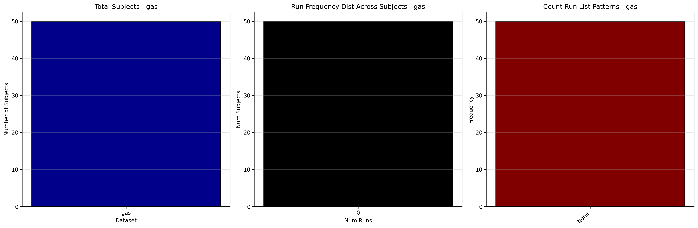

# Dataset Details: ds004604

NOTE: The events in this dataset are modeled using a traditional GLM approach purely for illustration purposes. While GLM can capture basic activation patterns, the authors' intent was to model these data using the [CVRMAP](https://github.com/ln2t/cvrmap) tool, which incorporates multiple physiological and timing features from the data and is specifically designed for cerebrovascular reactivity analysis. Furthermore, fMRIPrep's default high-pass filter of 128 seconds may not affect the 60-second CO2 inhalation periods but could potentially filter important signal components when considering the full CO2 and non-CO2 inhalation cycle (120 seconds total) as a single event. While this may not impact the current analysis, it represents an important methodological consideration for future work.

## Number of Subjects
- BIDS Input: 50

## Tasks and Trial Types
### Task: gas
- **Column Names**: onset, duration, trial_type
- **Data Types**: onset (int64), duration (int64), trial_type (object)
- **BOLD Volumes**: 120
- **Unique 'trial_type' Values**: gas

**Count Summaries**:

## MRIQC Summary Reports
- [group_T1w.html](https://htmlpreview.github.io/?https://github.com/demidenm/openneuro_glmfitlins/blob/main/statsmodel_specs/ds004604/mriqc_summary/group_T1w.html)
- [group_bold.html](https://htmlpreview.github.io/?https://github.com/demidenm/openneuro_glmfitlins/blob/main/statsmodel_specs/ds004604/mriqc_summary/group_bold.html)
