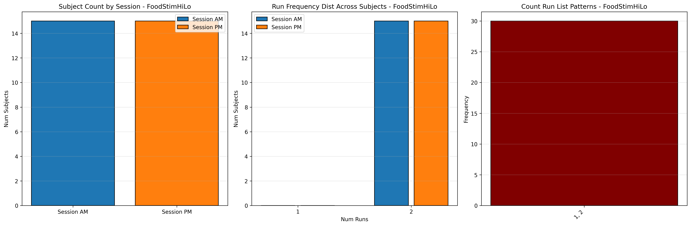

# Dataset Details: ds004656

## Number of Subjects
- BIDS Input: 15

## Sessions
- Sessions: AM, PM

## Tasks and Trial Types
### Task: FoodStimHiLo
- **Column Names**: onset, duration, condition
- **Data Types**: onset (int64), duration (int64), condition (object)
- **BOLD Volumes**: 270
- **Unique 'trial_type' Values**: None

**Count Summaries**:

## MRIQC Summary Reports
- [group_T1w.html](https://htmlpreview.github.io/?https://github.com/demidenm/openneuro_glmfitlins/blob/main/statsmodel_specs/ds004656/mriqc_summary/group_T1w.html)
- [group_bold.html](https://htmlpreview.github.io/?https://github.com/demidenm/openneuro_glmfitlins/blob/main/statsmodel_specs/ds004656/mriqc_summary/group_bold.html)
