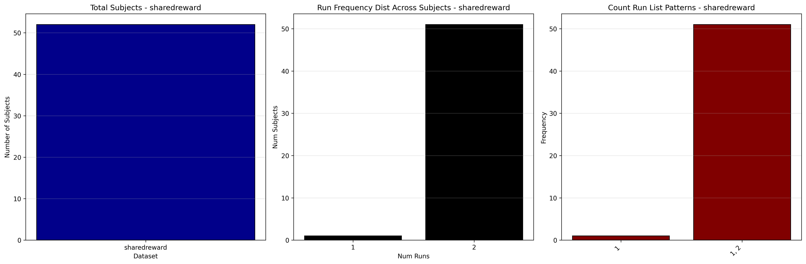
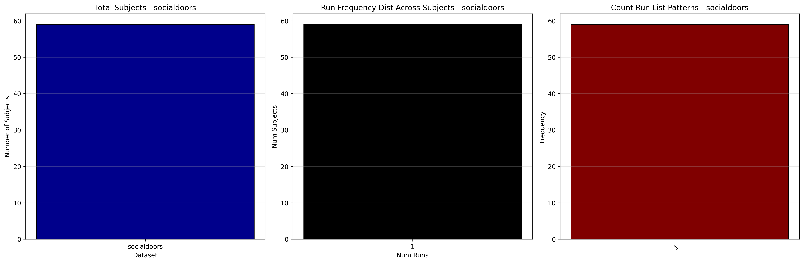

# Dataset Details: ds004920

## Number of Subjects
- BIDS Input: 59

## Tasks and Trial Types
### Task: doors
- **Column Names**: onset, duration, trial_type, rt, resp, gender, response_time, stim_file, TODO -- fill in rows and add more tab-separated columns if desired
- **Data Types**: onset (float64), duration (float64), trial_type (object), rt (float64), resp (object), gender (object), response_time (object), stim_file (object), TODO -- fill in rows and add more tab-separated columns if desired (object)
- **BOLD Volumes**: 293
- **Unique 'trial_type' Values**: decision, win, loss, decision-missed

**Count Summaries**:

### Task: mid
- **Column Names**: onset, duration, trial_type, response_time, stim_file, TODO -- fill in rows and add more tab-separated columns if desired
- **Data Types**: onset (float64), duration (float64), trial_type (object), response_time (object), stim_file (object), TODO -- fill in rows and add more tab-separated columns if desired (object)
- **BOLD Volumes**: 265
- **Unique 'trial_type' Values**: Small_loss, Neutral, Large_loss, Large_gain, Small_gain, ConHit, ConMiss

**Count Summaries**:

### Task: sharedreward
- **Column Names**: onset, duration, trial_type, response_time, stim_file, TODO -- fill in rows and add more tab-separated columns if desired
- **Data Types**: onset (float64), duration (float64), trial_type (object), response_time (float64), stim_file (object), TODO -- fill in rows and add more tab-separated columns if desired (object)
- **BOLD Volumes**: 231
- **Unique 'trial_type' Values**: event_stranger_punish, block_stranger_punish, event_stranger_neutral, event_stranger_reward, missed_trial, block_friend_reward, event_friend_punish, event_friend_reward, block_stranger_reward, event_friend_neutral, event_computer_punish, block_computer_punish, event_computer_neutral, block_friend_punish, event_computer_reward, block_computer_reward

**Count Summaries**:

### Task: socialdoors
- **Column Names**: onset, duration, trial_type, rt, resp, gender, response_time, stim_file, TODO -- fill in rows and add more tab-separated columns if desired
- **Data Types**: onset (float64), duration (float64), trial_type (object), rt (float64), resp (object), gender (object), response_time (object), stim_file (object), TODO -- fill in rows and add more tab-separated columns if desired (object)
- **BOLD Volumes**: 293
- **Unique 'trial_type' Values**: decision, win, loss, decision-missed, nan

**Count Summaries**:

### Task: ugdg
- **Column Names**: onset, duration, trial_type, response_time, Endowment, Endowment_pmod, Decision, Decision_pmod, stim_file, TODO -- fill in rows and add more tab-separated columns if desired
- **Data Types**: onset (float64), duration (float64), trial_type (object), response_time (float64), Endowment (float64), Endowment_pmod (float64), Decision (float64), Decision_pmod (float64), stim_file (object), TODO -- fill in rows and add more tab-separated columns if desired (object)
- **BOLD Volumes**: 225
- **Unique 'trial_type' Values**: cue_ug-resp_pmod, cue_ug-prop_pmod, cue_dict_pmod, dec_dg-prop_pmod_choice, dec_ug-resp_pmod_accept, dec_ug-resp_pmod_option_presented, dec_ug-resp_pmod_choice, dec_ug-prop_pmod_choice, dec_ug-resp_pmod_reject, missed_trial

**Count Summaries**:

## MRIQC Summary Reports
- [group_T1w.html](https://htmlpreview.github.io/?https://github.com/demidenm/openneuro_glmfitlins/blob/main/statsmodel_specs/ds004920/mriqc_summary/group_T1w.html)
- [group_bold.html](https://htmlpreview.github.io/?https://github.com/demidenm/openneuro_glmfitlins/blob/main/statsmodel_specs/ds004920/mriqc_summary/group_bold.html)
