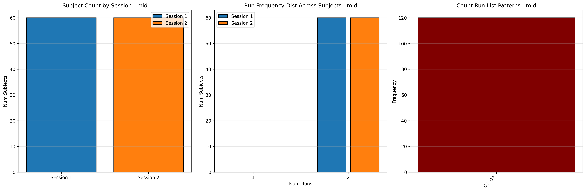

# Dataset Details: ds005012

## Number of Subjects
- BIDS Input: 60

## Sessions
- Sessions: 1, 2

## Tasks and Trial Types
### Task: mid
- **Column Names**: onset, duration, TRIAL_TYPE, CUE_ONSET, CUE_DURATION, FIXATION_ONSET, FIXATION_DURATION, PROBE_ONSET, PROBE_DURATION, FEEDBACK_ONSET, FEEDBACK_DURATION, TRIAL_RESULT, RESULT_REASON, PROBE_HIT, PROBE_MRT
- **Data Types**: onset (float64), duration (float64), TRIAL_TYPE (object), CUE_ONSET (float64), CUE_DURATION (int64), FIXATION_ONSET (float64), FIXATION_DURATION (float64), PROBE_ONSET (float64), PROBE_DURATION (float64), FEEDBACK_ONSET (float64), FEEDBACK_DURATION (float64), TRIAL_RESULT (object), RESULT_REASON (object), PROBE_HIT (int64), PROBE_MRT (int64)
- **BOLD Volumes**: 407
- **Unique 'trial_type' Values**: None

**Count Summaries**:

## MRIQC Summary Reports
- [group_T1w.html](https://htmlpreview.github.io/?https://github.com/demidenm/openneuro_glmfitlins/blob/main/statsmodel_specs/ds005012/mriqc_summary/group_T1w.html)
- [group_bold.html](https://htmlpreview.github.io/?https://github.com/demidenm/openneuro_glmfitlins/blob/main/statsmodel_specs/ds005012/mriqc_summary/group_bold.html)
