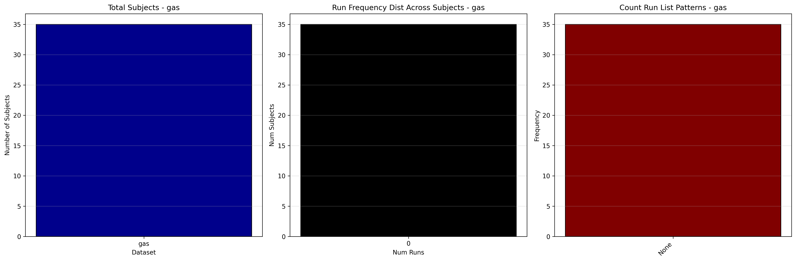

# Dataset Details: ds005418

## Number of Subjects
- BIDS Input: 35

## Tasks and Trial Types
### Task: gas
- **Column Names**: onset, duration, trial_type
- **Data Types**: onset (int64), duration (int64), trial_type (object)
- **BOLD Volumes**: 120
- **Unique 'trial_type' Values**: gas

**Count Summaries**:

